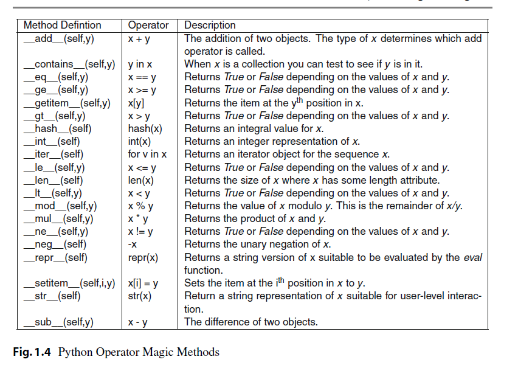

chapter 1: Introducing Algorithms
=======================================

1.1 The Interactive Interpreter
---------------------------------

.

1.2 Algo....What?
-------------------

Algorithm is just a fancy word for a procedure or recipe—a detailed
description of how to do something

1.3 Numbers and Expressions
-----------------------------

.. code-block:: python

    >>> 10 // 3
    3
    >>> 10 % 3
    1
    >>> 9 // 3
    3
    >>> 9 % 3
    0
    >>> 2.75 % 0.5
    0.25
    >>> 10 % 3
    1
    >>> 10 % -3
    -2
    >>> -10 % 3
    2
    >>> -10 % -3
    -1
    >>> 10 // 3
    3
    >>> 10 // -3
    -4
    >>> -10 // 3
    -4
    >>> -10 // -3
    3
    >>> 2 ** 3
    8
    >>> -3 ** 2
    -9
    >>> (-3) ** 2
    9

    >>> 0xAF
    175
    >>> 010
    8
    >>> 0b1011010010
    722

1.4 Variables
-------------------

>>> x = 3
x를 변수라고 하고 x에 3을 할당한다고 한다.

1.5 Statements
-------------------
Statements
expression

1.6 Getting Input from the User
----------------------------------

사용자 입력을 요구할때 쓰인다.

.. code-block:: python

    >>> input("The meaning of life: ")
    The meaning of life: 42
    '42'

1.7 Functions
-------------------
exponentiation operator (**) to calculate powers
다음과 같이 쓰인다.

.. code-block:: python

    >>> 2 ** 3
    8
    >>> pow(2, 3)
    8

    >>> abs(-10)
    10
    >>> 2 // 3
    0
    >>> round(2 / 3)
    1.0

1.8 Modules
-------------------
math 모듈은 다양한 수식 계산 함수들이 있다.

.. code-block:: python

    >>> import math
    >>> math.floor(32.9)
    32
the opposite of floor is ceil

.. code-block:: python

    >>> math.ceil(32.3)
    33
    >>> math.ceil(32)
    32

모듈 함수는 불필요하게 다 로딩할 필요가 없다.
필요한 함수만 로딩해서 쓰는게 메모리 관리에 좋다.

.. code-block:: python

    >>> from math import sqrt
    >>> sqrt(9)
    3.0

The square root of a negative number is a so-called imaginary
number, and numbers that are the sum of a real and an imaginary part are called complex

.. code-block:: python

    >>> import cmath
    >>> cmath.sqrt(-1)
    1j

.. code-block:: python

    >>> (1 + 3j) * (9 + 4j)
    (-3 + 31j)

1.9 Saving and Executing Your Programs
------------------------------------------

프린트 함수를 써서 간단한 텍스트를 표현해 보자.

test.py 로 저장하고

.. code-block:: python

    print("test")
    print('test')

입력을 받아서 표현하는 코드를 짜보자

.. code-block:: python

    name = input("What is your name? ")
    print("Hello, " + name + "!")

다음은 turtle 모듈에 대해서 알아보자.

.. code-block:: python

    from turtle import *
    import time

    forward(100)
    time.sleep(2)
    left(120)
    time.sleep(2)
    forward(100)
    time.sleep(2)
    left(120)
    time.sleep(2)
    forward(100)
    time.sleep(5)

 상기 코드들 실행하면 새로운 창이 뜨면서 그림을 그리게 된다.

Running Your Python Scripts from a Command Prompt
~~~~~~~~~~~~~~~~~~~~~~~~~~~~~~~~~~~~~~~~~~~~~~~~~~~~~~~~

파이션 코드는 명령어로 다음과 같이 실행하면 된다.

.. code-block:: python

    C:\>python hello.py
    or UNIX:
    $ python hello.py

파일을 실행할때는 파일을 실행권한으로 변경해야 한다.

$ chmod a+x hello.py

Comments
~~~~~~~~~~~~~~~

The hash sign (#) is a bit special in Python
* eclipse 단축키 : Ctrl +/   toggle
또는 아래처럼 쓴다.
"""
xxx
xxx
"""

1.10 Strings
-----------------

Single-Quoted Strings and Escaping Quotes
~~~~~~~~~~~~~~~~~~~~~~~~~~~~~~~~~~~~~~~~~~

.. code-block:: python

    >>> "Hello, world!"
    'Hello, world!'

    >>> 'Hello, world!'
    'Hello, world!'

동일하지만 유용할때가 있다.

.. code-block:: python

    >>> "Let's go!"
    "Let's go!"
    >>> '"Hello, world!" she said'
    '"Hello, world!" she said'

아래 코드는 오류가 난다.

.. code-block:: python

    >>> 'Let's go!'
    SyntaxError: invalid syntax

이럴때 backslash character (\) 사용한다.

.. code-block:: python

    >>> 'Let\'s go!'
    "Let's go!"

Concatenating Strings
~~~~~~~~~~~~~~~~~~~~~~~

.. code-block:: python

    >>> x = "Hello, "
    >>> y = "world!"
    >>> x y
    SyntaxError: invalid syntax

    >>> "Hello, " + "world!"
    'Hello, world!'
    >>> x = "Hello, "
    >>> y = "world!"
    >>> x + y
    'Hello, world!'
    String

String Representations, str and repr
~~~~~~~~~~~~~~~~~~~~~~~~~~~~~~~~~~~~~

.. code-block:: python

    >>> "Hello, world!"
    'Hello, world!'
    >>> print("Hello, world!")
    Hello, world!

    >>> "Hello,\nworld!"
    'Hello,\nworld!'
    >>> print("Hello,\nworld!")
    Hello,
    world!

Values are converted to strings through two different mechanisms. You can access both mechanisms
yourself, by using the functions str and repr.9 With str, you convert a value into a string in some reasonable
fashion that will probably be understood by a user, for example, converting any special character codes
to the corresponding characters, where possible. If you use repr, however, you will generally get a
representation of the value as a legal Python expression

.. code-block:: python

    >>> print(repr("Hello,\nworld!"))
    'Hello,\nworld!'
    >>> print(str("Hello,\nworld!"))
    Hello,
    world!

Long Strings, Raw Strings, and bytes
~~~~~~~~~~~~~~~~~~~~~~~~~~~~~~~~~~~~~

Long Strings
~~~~~~~~~~~~~~

.. code-block:: python

    print('''This is a very long string. It continues here.
    And it's not over yet. "Hello, world!"
    Still here.''')

일반 String도 \를 넣어서 만들수가 있다.

.. code-block:: python

    print("Hello, \ world!")

    >>> 1 + 2 + \
    4 + 5
    12
    >>> print \
    ('Hello, world')
    Hello, world

Raw Strings
~~~~~~~~~~~~~~

.. code-block:: python

    >>> print(r'C:\nowhere')
    C:\nowhere
    >>> print(r'C:\Program Files\fnord\foo\bar\baz\frozz\bozz')
    C:\Program Files\fnord\foo\bar\baz\frozz\bozz

Unicode, bytes, and bytearray
~~~~~~~~~~~~~~~~~~~~~~~~~~~~~~~~

.. code-block:: python

    >>> "\u00C6"
    'Æ'
    >>> "\U0001F60A"
    ''
    >>> "This is a cat: \N{Cat}"
    'This is a cat

unicode will update later

1.11 A Quick Summary
-----------------------

Algorithms:
~~~~~~~~~
An algorithm is a recipe telling you exactly how to perform a task.
When you program a computer, you are essentially describing an algorithm in
a language the computer can understand, such as Python. Such a machinefriendly
description is called a program, and it mainly consists of expressions and
statements.

Expressions:
~~~~~~~~~~~~
An expression is a part of a computer program that represents
a value. For example, 2 + 2 is an expression, representing the value 4. Simple
expressions are built from literal values (such as 2 or "Hello") by using operators
(such as + or %) and functions (such as pow). More complicated expressions
can be created by combining simpler expressions (e.g., (2 + 2) * (3 - 1)).
Expressions may also contain variables.

Variables:
~~~~~~~~~~~
 A variable is a name that represents a value. New values may be assigned
to variables through assignments such as x = 2. An assignment is a kind of statement.

Statements:
~~~~~~~~~~~~
A statement is an instruction that tells the computer to do
something. That may involve changing variables (through assignments), printing
things to the screen (such as print("Hello, world!")), importing modules, or
doing a host of other stuff.

Functions:
~~~~~~~~~~~~~
Functions in Python work just like functions in mathematics: they
may take some arguments, and they return a result. (They may actually do lots
of interesting stuff before returning, as you will find out when you learn to write
your own functions in Chapter 6.)

Modules:
~~~~~~~~~~~~~~
Modules are extensions that can be imported into Python to extend its
capabilities. For example, several useful mathematical functions are available in
the math module.
Programs: You have looked at the practicalities of writing, saving, and running
Python programs.

Strings:
~~~~~~~~~~~
Strings are really simple—they are just pieces of text, with characters
represented as Unicode code points. And yet there is a lot to know about them.
In this chapter, you’ve seen many ways to write them, and in Chapter 3 you learn
many ways of using them.

이 장에서 쓰인 새로운 함수들은 다음과 같다.

