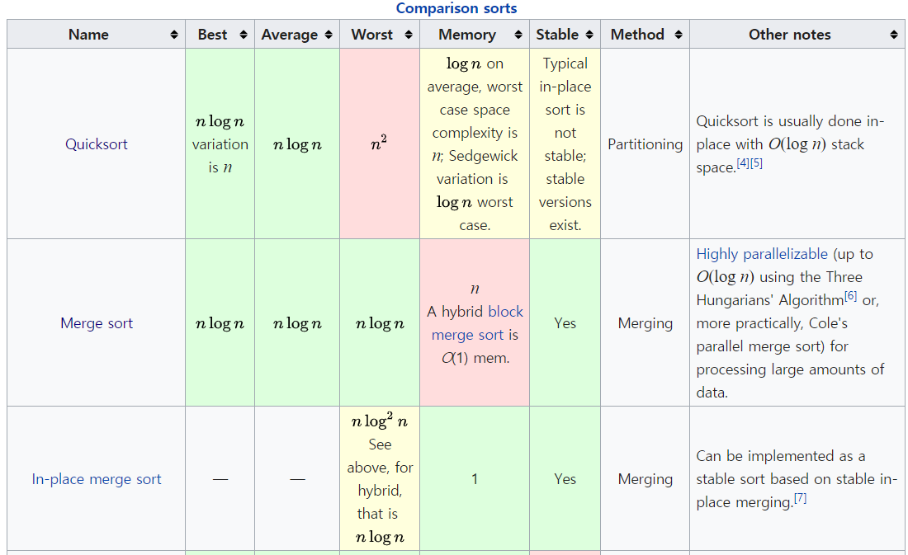
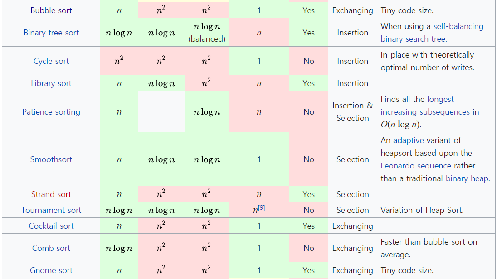
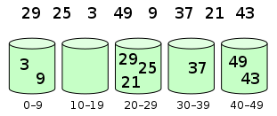

chapter 1: Sorting
=======================================

Comparison sorts
------------------
These are all comparison sorts, and so cannot perform better than O(n log n) in the average or worst case.

1.1 Bubble Sort
---------------------------------

.. image:: https://upload.wikimedia.org/wikipedia/commons/thumb/8/83/Bubblesort-edited-color.svg/220px-Bubblesort-edited-color.svg.png
   :target: https://upload.wikimedia.org/wikipedia/commons/thumb/8/83/Bubblesort-edited-color.svg/220px-Bubblesort-edited-color.svg.png
   :alt: alt text

**Bubble sort**\ , sometimes referred to as *sinking sort*\ , is a simple sorting algorithm that repeatedly steps through the list to be sorted, compares each pair of adjacent items and swaps them if they are in the wrong order. The pass through the list is repeated until no swaps are needed, which indicates that the list is sorted.

**Properties**

* Worst case performance    O(n\ :raw-html-m2r:`2`\ )
* Best case performance O(n)
* Average case performance  O(n\ :raw-html-m2r:`2`\ )

Source: `Wikipedia <https://en.wikipedia.org/wiki/Bubble_sort>`_
####################################################################

View the algorithm in `action <https://www.toptal.com/developers/sorting-algorithms/bubble-sort>`_
######################################################################################################
1.1.1 Step-by-step example
~~~~~~~~~~~~~~~~~~~~~~~~~~~~~

Take an array of numbers " 5 1 4 2 8", and sort the array from lowest number to greatest number
using bubble sort. In each step, elements written in bold are being compared.

Three passes will be required.

First Pass
~~~~~~~~~~~
( 5 1 4 2 8 ) → ( 1 5 4 2 8 ),

   Here, algorithm compares the first two elements,
   and swaps since 5 > 1.

( 1 5 4 2 8 ) → ( 1 4 5 2 8 ), Swap since 5 > 4

( 1 4 5 2 8 ) → ( 1 4 2 5 8 ), Swap since 5 > 2

( 1 4 2 5 8 ) → ( 1 4 2 5 8 ),
    Now, since these elements are already in order
    (8 > 5), algorithm does not swap them.

Second Pass
~~~~~~~~~~~~~
( 1 4 2 5 8 ) → ( 1 4 2 5 8 )

( 1 4 2 5 8 ) → ( 1 2 4 5 8 ), Swap since 4 > 2

( 1 2 4 5 8 ) → ( 1 2 4 5 8 )

( 1 2 4 5 8 ) → ( 1 2 4 5 8 )

Now, the array is already sorted, but the algorithm does not know
if it is completed.
The algorithm needs one whole pass without any swap to know it is sorted.

Third Pass
~~~~~~~~~~~~
( 1 2 4 5 8 ) → ( 1 2 4 5 8 )

( 1 2 4 5 8 ) → ( 1 2 4 5 8 )

( 1 2 4 5 8 ) → ( 1 2 4 5 8 )

( 1 2 4 5 8 ) → ( 1 2 4 5 8 )

1.1.2 Bubble sort Animation
~~~~~~~~~~~~~~~~~~~~~~~~~~~~~~

.. image:: ./img/chapter1-1.gif

http://www.cs.armstrong.edu/liang/animation/web/BubbleSort.html

1.1.3 Python Code
~~~~~~~~~~~~~~~~~~~~~~~~~

.. code-block:: python

    def bubble_sort(collection):
        """Pure implementation of bubble sort algorithm in Python

        :param collection: some mutable ordered collection with heterogeneous
        comparable items inside
        :return: the same collection ordered by ascending

        Examples:
        >>> bubble_sort([0, 5, 3, 2, 2])
        [0, 2, 2, 3, 5]

        >>> bubble_sort([])
        []

        >>> bubble_sort([-2, -5, -45])
        [-45, -5, -2]

        >>> bubble_sort([-23,0,6,-4,34])
        [-23,-4,0,6,34]
        """
        length = len(collection)
        for i in range(length-1):
            swapped = False
            for j in range(length-1-i):
                if collection[j] > collection[j+1]:
                    swapped = True
                    collection[j], collection[j+1] = collection[j+1], collection[j]
            if not swapped: break  # Stop iteration if the collection is sorted.
        return collection

    if __name__ == '__main__':
        #===========================================================================
        # try:
        #     raw_input          # Python 2
        # except NameError:
        #     raw_input = input  # Python 3
        #===========================================================================
        user_input = input('Enter numbers separated by a comma:').strip()
        unsorted = [int(item) for item in user_input.split(',')]
        print(*bubble_sort(unsorted), sep=',')

1.1.4 Bubble Sort Animation
~~~~~~~~~~~~~~~~~~~~~~~~~~~~~

.. code-block:: python

    import random
    import pygame
    from pygame.locals import *

    scr_size = (width,height) = (900,600)
    FPS = 20
    screen = pygame.display.set_mode(scr_size)
    clock = pygame.time.Clock()
    black = (0,0,0)
    white = (255,255,255)

    pygame.display.set_caption('Bubble Sort')

    def generatearray(lowerlimit,upperlimit,length):
        arr = []
        for i in range(0,length):
            arr.append(2*i)

            #arr.append(random.randrange(lowerlimit,upperlimit))

        random.shuffle(arr)
        return arr
    #    arr = []
    #    for i in range(0,length):
    #        arr.append(random.randrange(lowerlimit,upperlimit))
    #
    #    return arr

    class sort():
        def __init__(self,arr):
            self.arr = arr
            self.n = len(arr)
            self.i = 1
            self.image = pygame.Surface((width - width/5,height - height/5))
            self.rect = self.image.get_rect()
            self.rect.left = width/10
            self.rect.top = height/10
            self.width_per_bar = self.rect.width / self.n - 2

        def update(self):
            if self.i < self.n:
                self.image.fill(black)
                #################Sorting Algorithm here#############################
                for j in range(0,self.n - self.i):
                    if self.arr[j] > self.arr[j+1]:
                        self.arr[j],self.arr[j+1] = self.arr[j+1],self.arr[j]
                self.i += 1
                ####################################################################
                l = 0
                for k in range(0,int(self.rect.width),int(self.width_per_bar + 2)):
                    bar = pygame.Surface((self.width_per_bar,self.arr[l]))
                    bar_rect = bar.get_rect()
                    bar.fill(white)
                    bar_rect.bottom = self.rect.height
                    bar_rect.left = k

                    self.image.blit(bar,bar_rect)
                    l += 1

            else:
                pass

        def draw(self):
            screen.blit(self.image,self.rect)

    def main():
        arr = generatearray(1,height - height/5 - 10,240)
        bubble_sort = sort(arr)
        while True:
            for event in pygame.event.get():
                if event.type == pygame.QUIT:
                    quit()
                if event.type == pygame.KEYDOWN:
                    pass
                if event.type == pygame.KEYUP:
                    pass
            bubble_sort.update()
            screen.fill(black)
            print(bubble_sort.arr)
            bubble_sort.draw()
            pygame.display.update()
            clock.tick(FPS)

    main()

1.2 Selection Sort
---------------------------------

.. image:: https://upload.wikimedia.org/wikipedia/commons/thumb/b/b0/Selection_sort_animation.gif/250px-Selection_sort_animation.gif
   :target: https://upload.wikimedia.org/wikipedia/commons/thumb/b/b0/Selection_sort_animation.gif/250px-Selection_sort_animation.gif
   :alt: alt text

**Selection sort** is an algorithm that divides the input list into two parts: the sublist of items already sorted, which is built up from left to right at the front (left) of the list, and the sublist of items remaining to be sorted that occupy the rest of the list. Initially, the sorted sublist is empty and the unsorted sublist is the entire input list. The algorithm proceeds by finding the smallest (or largest, depending on sorting order) element in the unsorted sublist, exchanging (swapping) it with the leftmost unsorted element (putting it in sorted order), and moving the sublist boundaries one element to the right.

**Properties**

* Worst case performance    O(n\ :raw-html-m2r:`2`\ )
* Best case performance O(n\ :raw-html-m2r:`2`\ )
* Average case performance  O(n\ :raw-html-m2r:`2`\ )

Source: `Wikipedia <https://en.wikipedia.org/wiki/Selection_sort>`_
#######################################################################

View the algorithm in `action <https://www.toptal.com/developers/sorting-algorithms/selection-sort>`_
#########################################################################################################

1.2.1 Bubble sort Animation
~~~~~~~~~~~~~~~~~~~~~~~~~~~~~~

.. image:: ./img/chapter1-2.gif

http://www.cs.armstrong.edu/liang/animation/web/SelectionSort.html

1.2.2 Python Code
~~~~~~~~~~~~~~~~~~~~~~~~~

.. code-block:: python

    This is a pure python implementation of the selection sort algorithm

    For doctests run following command:
    python -m doctest -v selection_sort.py
    or
    python3 -m doctest -v selection_sort.py

    For manual testing run:
    python selection_sort.py

    from __future__ import print_function

    def selection_sort(collection):
        """Pure implementation of the selection sort algorithm in Python
        :param collection: some mutable ordered collection with heterogeneous
        comparable items inside
        :return: the same collection ordered by ascending

        Examples:
        >>> selection_sort([0, 5, 3, 2, 2])
        [0, 2, 2, 3, 5]

        >>> selection_sort([])
        []

        >>> selection_sort([-2, -5, -45])
        [-45, -5, -2]
        """

        length = len(collection)
        for i in range(length - 1):
            least = i
            for k in range(i + 1, length):
                if collection[k] < collection[least]:
                    least = k
            collection[least], collection[i] = (
                collection[i], collection[least]
            )
        return collection

    if __name__ == '__main__':
        #===========================================================================
        # try:
        #     raw_input          # Python 2
        # except NameError:
        #     raw_input = input  # Python 3
        #===========================================================================

        user_input = input('Enter numbers separated by a comma:\n').strip()
        unsorted = [int(item) for item in user_input.split(',')]
        print(selection_sort(unsorted))

1.2.3 Selection Sort Animation
~~~~~~~~~~~~~~~~~~~~~~~~~~~~~~~~

.. code-block:: python

    import random
    import pygame
    from pygame.locals import *

    scr_size = (width,height) = (900,600)
    FPS = 20
    screen = pygame.display.set_mode(scr_size)
    clock = pygame.time.Clock()
    black = (0,0,0)
    white = (255,255,255)

    pygame.display.set_caption('Selection Sort')

    def generatearray(lowerlimit,upperlimit,length):
        arr = []
        for i in range(0,length):
            arr.append(2*i)

            #arr.append(random.randrange(lowerlimit,upperlimit))

        random.shuffle(arr)
        return arr
    #    arr = []
    #    for i in range(0,length):
    #        arr.append(random.randrange(lowerlimit,upperlimit))
    #
    #    return arr

    class sort():
        def __init__(self,arr):
            self.arr = arr
            self.n = len(arr)
            self.i = 0
            self.image = pygame.Surface((width - width/5,height - height/5))
            self.rect = self.image.get_rect()
            self.rect.left = width/10
            self.rect.top = height/10
            self.width_per_bar = self.rect.width / self.n - 2

        def update(self):
            if self.i < self.n:
                self.image.fill(black)
                #################Sorting Algorithm here#############################
                small_index = self.i
                for j in range(self.i,self.n):
                    if self.arr[j] < self.arr[small_index]:
                        small_index = j
                self.arr[small_index],self.arr[self.i] = self.arr[self.i],self.arr[small_index]
                self.i += 1
                ####################################################################
                l = 0
                for k in range(0,int(self.rect.width),int(self.width_per_bar + 2)):
                    bar = pygame.Surface((self.width_per_bar,self.arr[l]))
                    bar_rect = bar.get_rect()
                    bar.fill(white)
                    bar_rect.bottom = self.rect.height
                    bar_rect.left = k

                    self.image.blit(bar,bar_rect)
                    l += 1

            else:
                pass

        def draw(self):
            screen.blit(self.image,self.rect)

    def main():
        arr = generatearray(1,height - height/5 - 10,240)
        selection_sort = sort(arr)
        while True:
            for event in pygame.event.get():
                if event.type == pygame.QUIT:
                    quit()
                if event.type == pygame.KEYDOWN:
                    pass
                if event.type == pygame.KEYUP:
                    pass
            selection_sort.update()
            screen.fill(black)
            print(selection_sort.arr)
            selection_sort.draw()
            pygame.display.update()
            clock.tick(FPS)

    main()

1.3 Insertion Sort
---------------------------------

.. image:: https://upload.wikimedia.org/wikipedia/commons/7/7e/Insertionsort-edited.png
   :target: https://upload.wikimedia.org/wikipedia/commons/7/7e/Insertionsort-edited.png
   :alt: alt text

**Insertion sort** is a simple sorting algorithm that builds the final sorted array (or list) one item at a time. It is much less efficient on *large* lists than more advanced algorithms such as quicksort, heapsort, or merge sort.

**Properties**

* Worst case performance    O(n\ :raw-html-m2r:`2`\ )
* Best case performance O(n)
* Average case performance  O(n\ :raw-html-m2r:`2`\ )

Source: `Wikipedia <https://en.wikipedia.org/wiki/Insertion_sort>`_
#######################################################################

View the algorithm in `action <https://www.toptal.com/developers/sorting-algorithms/insertion-sort>`_
#########################################################################################################

1.3.1 Inertion sort Animation
~~~~~~~~~~~~~~~~~~~~~~~~~~~~~~~

.. image:: ./img/chapter1-3.gif

http://www.cs.armstrong.edu/liang/animation/web/SelectionSort.html

1.3.2 Python Code
~~~~~~~~~~~~~~~~~~~~~~~~~

.. code-block:: python

    def insertion_sort(collection):
        """Pure implementation of the insertion sort algorithm in Python

        :param collection: some mutable ordered collection with heterogeneous
        comparable items inside
        :return: the same collection ordered by ascending

        Examples:
        >>> insertion_sort([0, 5, 3, 2, 2])
        [0, 2, 2, 3, 5]

        >>> insertion_sort([])
        []

        >>> insertion_sort([-2, -5, -45])
        [-45, -5, -2]
        """
        for index in range(1, len(collection)):
            while index > 0 and collection[index - 1] > collection[index]:
                collection[index], collection[index - 1] = collection[index - 1], collection[index]
                index -= 1

        return collection

    if __name__ == '__main__':
        #===========================================================================
        # try:
        #     raw_input          # Python 2
        # except NameError:
        #     raw_input = input  # Python 3
        #===========================================================================
        user_input = input('Enter numbers separated by a comma:\n').strip()
        unsorted = [int(item) for item in user_input.split(',')]
        print(insertion_sort(unsorted))

1.3.3 Selection Sort Animation
~~~~~~~~~~~~~~~~~~~~~~~~~~~~~~~~

.. code-block:: python

    import random
    import pygame
    from pygame.locals import *

    scr_size = (width,height) = (900,600)
    FPS = 20
    screen = pygame.display.set_mode(scr_size)
    clock = pygame.time.Clock()
    black = (0,0,0)
    white = (255,255,255)

    pygame.display.set_caption('Insertion Sort')

    def generatearray(lowerlimit,upperlimit,length):
        arr = []
        for i in range(0,length):
            arr.append(2*i)

            #arr.append(random.randrange(lowerlimit,upperlimit))

        random.shuffle(arr)
        return arr
    #    arr = []
    #    for i in range(0,length):
    #        arr.append(random.randrange(lowerlimit,upperlimit))
    #
    #    return arr

    class sort():
        def __init__(self,arr):
            self.arr = arr
            self.n = len(arr)
            self.i = 2
            self.image = pygame.Surface((width - width/5,height - height/5))
            self.rect = self.image.get_rect()
            self.rect.left = width/10
            self.rect.top = height/10
            self.width_per_bar = self.rect.width / self.n - 2

        def update(self):
            if self.i < self.n:
                self.image.fill(black)
                #################Sorting Algorithm here#############################
                for j in range(self.i,0,-1):
                    if self.arr[j] < self.arr[j-1]:
                        self.arr[j],self.arr[j - 1] = self.arr[j - 1],self.arr[j]
                self.i += 1
                ####################################################################
                l = 0
                for k in range(0,int(self.rect.width),int(self.width_per_bar + 2)):
                    bar = pygame.Surface((self.width_per_bar,self.arr[l]))
                    bar_rect = bar.get_rect()
                    bar.fill(white)
                    bar_rect.bottom = self.rect.height
                    bar_rect.left = k

                    self.image.blit(bar,bar_rect)
                    l += 1

            else:
                pass

        def draw(self):
            screen.blit(self.image,self.rect)

    def main():
        arr = generatearray(1,height - height/5 - 10,240)
        insertion_sort = sort(arr)
        while True:
            for event in pygame.event.get():
                if event.type == pygame.QUIT:
                    quit()
                if event.type == pygame.KEYDOWN:
                    pass
                if event.type == pygame.KEYUP:
                    pass
            insertion_sort.update()
            screen.fill(black)
            print(insertion_sort.arr)
            insertion_sort.draw()
            pygame.display.update()
            clock.tick(FPS)

    main()

1.4 Merge Sort
---------------------------------

.. image:: https://upload.wikimedia.org/wikipedia/commons/c/cc/Merge-sort-example-300px.gif
   :target: https://upload.wikimedia.org/wikipedia/commons/c/cc/Merge-sort-example-300px.gif
   :alt: alt text

**Merge sort** (also commonly spelled *mergesort*\ ) is an efficient, general-purpose, comparison-based sorting algorithm. Most implementations produce a stable sort, which means that the implementation preserves the input order of equal elements in the sorted output. Mergesort is a divide and conquer algorithm that was invented by John von Neumann in 1945.

**Properties**

* Worst case performance    O(n log n)
* Best case performance O(n log n)
* Average case performance  O(n log n)

Source: `Wikipedia <https://en.wikipedia.org/wiki/Merge_sort>`_
###################################################################

View the algorithm in `action <https://www.toptal.com/developers/sorting-algorithms/merge-sort>`_
#####################################################################################################

1.4.1 Merge sort Animation
~~~~~~~~~~~~~~~~~~~~~~~~~~~~~

.. image:: ./img/chapter1-4.gif

https://yongdanielliang.github.io/animation/web/MergeSortOverview.html

1.4.2 Python Code
~~~~~~~~~~~~~~~~~~~~~~~~~

.. code-block:: python

    def merge_sort(collection):
        """Pure implementation of the merge sort algorithm in Python

        :param collection: some mutable ordered collection with heterogeneous
        comparable items inside
        :return: the same collection ordered by ascending

        Examples:
        >>> merge_sort([0, 5, 3, 2, 2])
        [0, 2, 2, 3, 5]

        >>> merge_sort([])
        []

        >>> merge_sort([-2, -5, -45])
        [-45, -5, -2]
        """
        length = len(collection)
        if length > 1:
            midpoint = length // 2
            left_half = merge_sort(collection[:midpoint])
            right_half = merge_sort(collection[midpoint:])
            i = 0
            j = 0
            k = 0
            left_length = len(left_half)
            right_length = len(right_half)
            while i < left_length and j < right_length:
                if left_half[i] < right_half[j]:
                    collection[k] = left_half[i]
                    i += 1
                else:
                    collection[k] = right_half[j]
                    j += 1
                k += 1

            while i < left_length:
                collection[k] = left_half[i]
                i += 1
                k += 1

            while j < right_length:
                collection[k] = right_half[j]
                j += 1
                k += 1

        return collection

    if __name__ == '__main__':
        #===========================================================================
        # try:
        #     raw_input          # Python 2
        # except NameError:
        #     raw_input = input  # Python 3
        #===========================================================================

        user_input = input('Enter numbers separated by a comma:\n').strip()
        unsorted = [int(item) for item in user_input.split(',')]
        print(merge_sort(unsorted))

    #===========================================================================

    Python implementation of merge sort algorithm.
    Takes an average of 0.6 microseconds to sort a list of length 1000 items.
    Best Case Scenario : O(n)
    Worst Case Scenario : O(n)

    def merge_sort(LIST):
        start = []
        end = []
        while len(LIST) > 1:
            a = min(LIST)
            b = max(LIST)
            start.append(a)
            end.append(b)
            LIST.remove(a)
            LIST.remove(b)
        if LIST: start.append(LIST[0])
        end.reverse()
        return (start + end)

1.4.3 Merge Sort Animation
~~~~~~~~~~~~~~~~~~~~~~~~~~~~~

.. code-block:: python

    import random
    import pygame
    from pygame.locals import *

    scr_size = (width,height) = (900,600)
    FPS = 40
    screen = pygame.display.set_mode(scr_size)
    clock = pygame.time.Clock()
    black = (0,0,0)
    white = (255,255,255)

    pygame.display.set_caption('Merge Sort')

    def generatearray(lowerlimit,upperlimit,length):
        arr = []
        for i in range(0,length):
            arr.append(2*i)

            #arr.append(random.randrange(lowerlimit,upperlimit))

        random.shuffle(arr)
        return arr
    #    arr = []
    #    for i in range(0,length):
    #        arr.append(random.randrange(lowerlimit,upperlimit))
    #
    #    return arr

    def mergesort(arr,temparr,left,right):
        if left < right:
            mid = int((left + right)/2)
            mergesort(arr,temparr,left,mid)
            mergesort(arr,temparr,mid+1,right)
            merge(arr,temparr,left,mid + 1,right)

        else:
            pass

    def merge(arr,temp,left,mid,right):
        left_end = mid - 1
        temp_pos = left
        size = right - left + 1

        while left <= left_end and mid<=right:
            if arr[left] <= arr[mid]:
                temp[temp_pos] = arr[left]
                temp_pos = temp_pos + 1
                left = left + 1
            else:
                temp[temp_pos] = arr[mid]
                temp_pos = temp_pos + 1
                mid = mid + 1

        while left<=left_end:
            temp[temp_pos] = arr[left]
            left = left + 1
            temp_pos = temp_pos + 1

        while mid <= right:
            temp[temp_pos] = arr[mid]
            mid = mid + 1
            temp_pos = temp_pos + 1

        for i in range(0,size):
            arr[right] = temp[right]
            right = right - 1
            displayarray(arr)

    def displayarray(arr):
        image = pygame.Surface((width - width/5,height - height/5))
        rect = image.get_rect()
        rect.top = height/10
        rect.left =  width/10
        width_per_bar = rect.width/len(arr) - 2

        l = 0
        for k in range(0,int(rect.width),int(width_per_bar + 2)):
            bar = pygame.Surface((width_per_bar,arr[l]))
            bar_rect = bar.get_rect()
            bar.fill(white)
            bar_rect.bottom = rect.height
            bar_rect.left = k

            image.blit(bar,bar_rect)
            l += 1

        screen.fill(black)
        screen.blit(image,rect)
        pygame.display.update()
        clock.tick(FPS)

    def main():
        arr = generatearray(1,height - height/5 - 10,240)
        temparr = [0]*len(arr)
        while True:
            for event in pygame.event.get():
                if event.type == pygame.QUIT:
                    quit()
                if event.type == pygame.KEYDOWN:
                    pass
                if event.type == pygame.KEYUP:
                    pass

            if sorted(arr) != arr:
                mergesort(arr,temparr,0,len(arr) - 1)
            else:
                displayarray(arr)

    main()

1.5 Quick Sort
---------------------------------

.. image:: https://upload.wikimedia.org/wikipedia/commons/6/6a/Sorting_quicksort_anim.gif
   :target: https://upload.wikimedia.org/wikipedia/commons/6/6a/Sorting_quicksort_anim.gif
   :alt: alt text

**Quicksort** (sometimes called *partition-exchange sort*\ ) is an efficient sorting algorithm, serving as a systematic method for placing the elements of an array in order.

**Properties**

* Worst case performance    O(n\ :raw-html-m2r:`2`\ )
* Best case performance O(\ *n* log *n*\ ) or O(n) with three-way partition
* Average case performance  O(\ *n* log *n*\ )

Source: `Wikipedia <https://en.wikipedia.org/wiki/Quickselect>`_
####################################################################

View the algorithm in `action <https://www.toptal.com/developers/sorting-algorithms/quick-sort>`_
#####################################################################################################

1.5.1 Quick sort Animation
~~~~~~~~~~~~~~~~~~~~~~~~~

.. image:: ./img/chapter1-5.gif

http://www.cs.armstrong.edu/liang/animation/web/QuickSortOverview.html

1.5.2 Python Code
~~~~~~~~~~~~~~~~~~~~~~~~~

.. code-block:: python

    This is a pure python implementation of the quick sort algorithm

    For doctests run following command:
    python -m doctest -v quick_sort.py
    or
    python3 -m doctest -v quick_sort.py

    For manual testing run:
    python quick_sort.py

    from __future__ import print_function

    def quick_sort(ARRAY):
        """Pure implementation of quick sort algorithm in Python

        :param collection: some mutable ordered collection with heterogeneous
        comparable items inside
        :return: the same collection ordered by ascending

        Examples:
        >>> quick_sort([0, 5, 3, 2, 2])
        [0, 2, 2, 3, 5]

        >>> quick_sort([])
        []

        >>> quick_sort([-2, -5, -45])
        [-45, -5, -2]
        """
        ARRAY_LENGTH = len(ARRAY)
        if( ARRAY_LENGTH <= 1):
            return ARRAY
        else:
            PIVOT = ARRAY[0]
            GREATER = [ element for element in ARRAY[1:] if element > PIVOT ]
            LESSER = [ element for element in ARRAY[1:] if element <= PIVOT ]
            return quick_sort(LESSER) + [PIVOT] + quick_sort(GREATER)

    if __name__ == '__main__':
        #===========================================================================
        # try:
        #     raw_input          # Python 2
        # except NameError:
        #     raw_input = input  # Python 3
        #===========================================================================

        user_input = input('Enter numbers separated by a comma:\n').strip()
        unsorted = [ int(item) for item in user_input.split(',') ]
        print( quick_sort(unsorted) )
    #=======================================================================
    from __future__ import print_function

    def quick_sort_3partition(sorting, left, right):
        if right <= left:
            return
        a = i = left
        b = right
        pivot = sorting[left]
        while i <= b:
            if sorting[i] < pivot:
                sorting[a], sorting[i] = sorting[i], sorting[a]
                a += 1
                i += 1
            elif sorting[i] > pivot:
                sorting[b], sorting[i] = sorting[i], sorting[b]
                b -= 1
            else:
                i += 1
        quick_sort_3partition(sorting, left, a - 1)
        quick_sort_3partition(sorting, b + 1, right)

    if __name__ == '__main__':
        #===========================================================================
        # try:
        #     raw_input          # Python 2
        # except NameError:
        #     raw_input = input  # Python 3
        #===========================================================================

        user_input = input('Enter numbers separated by a comma:\n').strip()
        unsorted = [ int(item) for item in user_input.split(',') ]
        quick_sort_3partition(unsorted,0,len(unsorted)-1)
        print(unsorted)

1.5.3 Quick Sort Animation
~~~~~~~~~~~~~~~~~~~~~~~~~~~~~

.. code-block:: python

    import random
    import pygame
    from pygame.locals import *

    scr_size = (width,height) = (900,600)
    FPS = 40
    screen = pygame.display.set_mode(scr_size)
    clock = pygame.time.Clock()
    black = (0,0,0)
    white = (255,255,255)

    pygame.display.set_caption('Quick Sort')

    def generatearray(lowerlimit,upperlimit,length):
        arr = []
        for i in range(0,length):
            arr.append(2*i)

            #arr.append(random.randrange(lowerlimit,upperlimit))

        random.shuffle(arr)
        return arr
    #    arr = []
    #    for i in range(0,length):
    #        arr.append(random.randrange(lowerlimit,upperlimit))
    #
    #    return arr

    def partition(arr,low,high):
        i = low-1
        pivot = arr[high]
        for j in range(low , high):
            if   arr[j] <= pivot:
                i = i+1
                arr[i],arr[j] = arr[j],arr[i]
                displayarray(arr)
        arr[i+1],arr[high] = arr[high],arr[i+1]
        return i+1

    def quicksort(arr,low,high):
        if low < high:
            pi = partition(arr,low,high)
            quicksort(arr, low, pi-1)
            quicksort(arr, pi+1, high)

    def displayarray(arr):
        image = pygame.Surface((width - width/5,height - height/5))
        rect = image.get_rect()
        rect.top = height/10
        rect.left =  width/10
        width_per_bar = rect.width/len(arr) - 2

        l = 0
        for k in range(0,int(rect.width),int(width_per_bar + 2)):
            bar = pygame.Surface((width_per_bar,arr[l]))
            bar_rect = bar.get_rect()
            bar.fill(white)
            bar_rect.bottom = rect.height
            bar_rect.left = k

            image.blit(bar,bar_rect)
            l += 1

        screen.fill(black)
        screen.blit(image,rect)
        pygame.display.update()
        clock.tick(FPS)

    def main():
        arr = generatearray(1,height - height/5 - 10,240)
        temparr = [0]*len(arr)
        while True:
            for event in pygame.event.get():
                if event.type == pygame.QUIT:
                    quit()
                if event.type == pygame.KEYDOWN:
                    pass
                if event.type == pygame.KEYUP:
                    pass

            if sorted(arr) != arr:
                quicksort(arr,0,len(arr) - 1)
            else:
                displayarray(arr)

    main()

1.6 Heap Sort
---------------------------------

**Heapsort** is a *comparison-based* sorting algorithm. It can be thought of as an improved selection sort. It divides its input into a sorted and an unsorted region, and it iteratively shrinks the unsorted region by extracting the largest element and moving that to the sorted region.

**Properties**

* Worst case performance    O(\ *n* log *n*\ )
* Best case performance O(\ *n* log *n*\ )
* Average case performance  O(\ *n* log *n*\ )

Source: `Wikipedia <https://en.wikipedia.org/wiki/Heapsort>`_
#################################################################

View the algorithm in `action <https://www.toptal.com/developers/sorting-algorithms/heap-sort>`_
####################################################################################################

1.6.1 Heap sort Animation
~~~~~~~~~~~~~~~~~~~~~~~~~~~~

.. image:: ./img/chapter1-6.gif

1.6.2 Python Code
~~~~~~~~~~~~~~~~~~~~~~~~~

.. code-block:: python

    This is a pure python implementation of the heap sort algorithm.

    For doctests run following command:
    python -m doctest -v heap_sort.py
    or
    python3 -m doctest -v heap_sort.py

    For manual testing run:
    python heap_sort.py

    from __future__ import print_function

    def heapify(unsorted, index, heap_size):
        largest = index
        left_index = 2 * index + 1
        right_index = 2 * index + 2
        if left_index < heap_size and unsorted[left_index] > unsorted[largest]:
            largest = left_index

        if right_index < heap_size and unsorted[right_index] > unsorted[largest]:
            largest = right_index

        if largest != index:
            unsorted[largest], unsorted[index] = unsorted[index], unsorted[largest]
            heapify(unsorted, largest, heap_size)

    def heap_sort(unsorted):
        '''
        Pure implementation of the heap sort algorithm in Python
        :param collection: some mutable ordered collection with heterogeneous
        comparable items inside
        :return: the same collection ordered by ascending

        Examples:
        >>> heap_sort([0, 5, 3, 2, 2])
        [0, 2, 2, 3, 5]

        >>> heap_sort([])
        []

        >>> heap_sort([-2, -5, -45])
        [-45, -5, -2]
        '''
        n = len(unsorted)
        for i in range(n // 2 - 1, -1, -1):
            heapify(unsorted, i, n)
        for i in range(n - 1, 0, -1):
            unsorted[0], unsorted[i] = unsorted[i], unsorted[0]
            heapify(unsorted, 0, i)
        return unsorted

    if __name__ == '__main__':
        #===========================================================================
        # try:
        #     raw_input          # Python 2
        # except NameError:
        #     raw_input = input  # Python 3
        #===========================================================================

        user_input = input('Enter numbers separated by a comma:\n').strip()
        unsorted = [int(item) for item in user_input.split(',')]
        print(heap_sort(unsorted))

1.6.3 Heap Sort Animation
~~~~~~~~~~~~~~~~~~~~~~~~~~~~~

.. code-block:: python

    import random
    import pygame
    from pygame.locals import *

    scr_size = (width,height) = (900,600)
    FPS = 80
    screen = pygame.display.set_mode(scr_size)
    clock = pygame.time.Clock()
    black = (0,0,0)
    white = (255,255,255)

    pygame.display.set_caption('Heap Sort')

    def generatearray(lowerlimit,upperlimit,length):
        arr = []
        for i in range(0,length):
            arr.append(2*i)

            #arr.append(random.randrange(lowerlimit,upperlimit))

        random.shuffle(arr)
        return arr
    #    arr = []
    #    for i in range(0,length):
    #        arr.append(random.randrange(lowerlimit,upperlimit))
    #
    #    return arr

    def heapify(arr, n, i):
        largest = i
        l = 2 * i + 1
        r = 2 * i + 2

        if l < n and arr[i] < arr[l]:
            largest = l

        if r < n and arr[largest] < arr[r]:
            largest = r

        if largest != i:
            arr[i],arr[largest] = arr[largest],arr[i]

            heapify(arr, n, largest)
        displayarray(arr)

    def heapSort(arr):
        n = len(arr)

        for i in range(n, -1, -1):
            heapify(arr, n, i)

        for i in range(n-1, 0, -1):
            arr[i], arr[0] = arr[0], arr[i]
            heapify(arr, i, 0)

    def displayarray(arr):
        image = pygame.Surface((width - width/5,height - height/5))
        rect = image.get_rect()
        rect.top = height/10
        rect.left =  width/10
        width_per_bar = rect.width/len(arr) - 2

        l = 0
        for k in range(0,int(rect.width),int(width_per_bar + 2)):
            bar = pygame.Surface((width_per_bar,arr[l]))
            bar_rect = bar.get_rect()
            bar.fill(white)
            bar_rect.bottom = rect.height
            bar_rect.left = k

            image.blit(bar,bar_rect)
            l += 1

        screen.fill(black)
        screen.blit(image,rect)
        pygame.display.update()
        clock.tick(FPS)

    def main():
        arr = generatearray(1,height - height/5 - 10,240)
        temparr = [0]*len(arr)
        while True:
            for event in pygame.event.get():
                if event.type == pygame.QUIT:
                    quit()
                if event.type == pygame.KEYDOWN:
                    pass
                if event.type == pygame.KEYUP:
                    pass

            if sorted(arr) != arr:
                heapSort(arr)
            else:
                displayarray(arr)

    main()

1.7 Randix Sort
---------------------------------

From `Wikipedia <https://en.wikipedia.org/wiki/Radix_sort>`_\ : Radix sort is a non-comparative integer sorting algorithm that sorts data with integer keys by grouping keys by the individual digits which share the same significant position and value.

**Properties**

* Worst case performance    O(wn)
* Best case performance O(wn)
* Average case performance  O(wn)

Source: `Wikipedia <https://en.wikipedia.org/wiki/Radix_sort>`_
###################################################################

1.7.1 Randix sort Animation
~~~~~~~~~~~~~~~~~~~~~~~~~~~~~

.. image:: ./img/chapter1-7.gif

http://www.cs.armstrong.edu/liang/animation/web/RadixSort.html

1.7.2 Python Code
~~~~~~~~~~~~~~~~~~~~~~~~~

.. code-block:: python

    def radixsort(lst):
      RADIX = 10
      maxLength = False
      tmp , placement = -1, 1

      while not maxLength:
        maxLength = True
        # declare and initialize buckets
        buckets = [list() for _ in range( RADIX )]

        # split lst between lists
        for i in lst:
          tmp = int((i / placement) % RADIX)
          buckets[tmp].append(i)

          if maxLength and tmp > 0:
            maxLength = False

        # empty lists into lst array
        a = 0
        for b in range( RADIX ):
          buck = buckets[b]
          for i in buck:
            lst[a] = i
            a += 1

        # move to next
        placement *= RADIX

1.7.3 Randix Sort Animation
~~~~~~~~~~~~~~~~~~~~~~~~~~~~~

.. code-block:: python

    import random
    import pygame
    from pygame.locals import *

    scr_size = (width,height) = (900,600)
    FPS = 40
    screen = pygame.display.set_mode(scr_size)
    clock = pygame.time.Clock()
    black = (0,0,0)
    white = (255,255,255)

    pygame.display.set_caption('Radix Sort')

    def generatearray(lowerlimit,upperlimit,length):
        arr = []
        for i in range(0,length):
            arr.append(2*i)

            #arr.append(random.randrange(lowerlimit,upperlimit))

        random.shuffle(arr)
        return arr
    #    arr = []
    #    for i in range(0,length):
    #        arr.append(random.randrange(lowerlimit,upperlimit))
    #
    #    return arr

    def countingSort(arr, exp1):
        n = len(arr)
        output = [0] * (n)

        count = [0] * (10)

        for i in range(0, n):
            index = (arr[i]/exp1)
            count[ int((index)%10) ] += 1

        for i in range(1,10):
            count[i] += count[i-1]

        i = n-1
        while i>=0:
            index = (arr[i]/exp1)
            output[ count[ int((index)%10) ] - 1] = arr[i]
            count[ int((index)%10) ] -= 1
            i -= 1

        i = 0
        for i in range(0,len(arr)):
            arr[i] = output[i]
            displayarray(arr)

    def radixSort(arr):

        max1 = max(arr)
        exp = 1
        while max1/exp > 0:
            countingSort(arr,exp)
            exp *= 10

    def displayarray(arr):
        image = pygame.Surface((width - width/5,height - height/5))
        rect = image.get_rect()
        rect.top = height/10
        rect.left =  width/10
        width_per_bar = rect.width/len(arr) - 2

        l = 0
        for k in range(0,int(rect.width),int(width_per_bar + 2)):
            bar = pygame.Surface((width_per_bar,arr[l]))
            bar_rect = bar.get_rect()
            bar.fill(white)
            bar_rect.bottom = rect.height
            bar_rect.left = k

            image.blit(bar,bar_rect)
            l += 1

        screen.fill(black)
        screen.blit(image,rect)
        pygame.display.update()
        clock.tick(FPS)

    def main():
        arr = generatearray(1,height - height/5 - 10,240)
        temparr = [0]*len(arr)
        while True:
            for event in pygame.event.get():
                if event.type == pygame.QUIT:
                    quit()
                if event.type == pygame.KEYDOWN:
                    pass
                if event.type == pygame.KEYUP:
                    pass

            if sorted(arr) != arr:
                radixSort(arr)
            else:
                displayarray(arr)

    main()

1.8 Cocktail shaker sort
---------------------------------

.. image:: https://upload.wikimedia.org/wikipedia/commons/e/ef/Sorting_shaker_sort_anim.gif
   :target: https://upload.wikimedia.org/wikipedia/commons/e/ef/Sorting_shaker_sort_anim.gif
   :alt: alt text

**Cocktail shaker sort**\ , also known as *bidirectional bubble sort*\ , *cocktail sort*\ , *shaker sort* (which can also refer to a variant of *selection sort*\ ), *ripple sort*\ , *shuffle sort*\ , or *shuttle sort*\ , is a variation of bubble sort that is both a stable sorting algorithm and a comparison sort. The algorithm differs from a bubble sort in that it sorts in both directions on each pass through the list.

**Properties**

* Worst case performance    O(n\ :raw-html-m2r:`2`\ )
* Best case performance O(n)
* Average case performance  O(n\ :raw-html-m2r:`2`\ )

Source: `Wikipedia <https://en.wikipedia.org/wiki/Cocktail_shaker_sort>`_
#############################################################################

1.8.1 Cocktail shaker sort Animation
~~~~~~~~~~~~~~~~~~~~~~~~~~~~~~~~~~~~~~

.. image:: ./img/chapter1-8.gif

1.8.2 Python Code
~~~~~~~~~~~~~~~~~~~~~~~~~

.. code-block:: python

    from __future__ import print_function

    def cocktail_shaker_sort(unsorted):
        """
        Pure implementation of the cocktail shaker sort algorithm in Python.
        """
        for i in range(len(unsorted)-1, 0, -1):
            swapped = False

            for j in range(i, 0, -1):
                if unsorted[j] < unsorted[j-1]:
                    unsorted[j], unsorted[j-1] = unsorted[j-1], unsorted[j]
                    swapped = True

            for j in range(i):
                if unsorted[j] > unsorted[j+1]:
                    unsorted[j], unsorted[j+1] = unsorted[j+1], unsorted[j]
                    swapped = True

            if not swapped:
                return unsorted

    if __name__ == '__main__':
        try:
            raw_input          # Python 2
        except NameError:
            raw_input = input  # Python 3

        user_input = raw_input('Enter numbers separated by a comma:\n').strip()
        unsorted = [int(item) for item in user_input.split(',')]
        cocktail_shaker_sort(unsorted)
        print(unsorted)

1.9 Shell sort
---------------------------------

.. image:: https://upload.wikimedia.org/wikipedia/commons/d/d8/Sorting_shellsort_anim.gif
   :target: https://upload.wikimedia.org/wikipedia/commons/d/d8/Sorting_shellsort_anim.gif
   :alt: alt text

**Shellsort** is a generalization of *insertion sort* that allows the exchange of items that are far apart.  The idea is to arrange the list of elements so that, starting anywhere, considering every nth element gives a sorted list.  Such a list is said to be h-sorted.  Equivalently, it can be thought of as h interleaved lists, each individually sorted.

**Properties**

* Worst case performance O(\ *n*\ log\ :raw-html-m2r:`2`\ *n*\ )
* Best case performance O(\ *n* log *n*\ )
* Average case performance depends on gap sequence

Source: `Wikipedia <https://en.wikipedia.org/wiki/Shellsort>`_
##################################################################

View the algorithm in `action <https://www.toptal.com/developers/sorting-algorithms/shell-sort>`_
#####################################################################################################

1.9.1 Shell sort Animation
~~~~~~~~~~~~~~~~~~~~~~~~~~~~~

.. image:: ./img/chapter1-9.gif

The step-by-step process of replacing pairs of items during the shell sorting algorithm.

.. image:: ./img/chapter1-1-9.png

1.9.2 Python Code
~~~~~~~~~~~~~~~~~~~~~~~~~

.. code-block:: python

    This is a pure python implementation of the shell sort algorithm

    For doctests run following command:
    python -m doctest -v shell_sort.py
    or
    python3 -m doctest -v shell_sort.py

    For manual testing run:
    python shell_sort.py

    from __future__ import print_function

    def shell_sort(collection):
        """Pure implementation of shell sort algorithm in Python
        :param collection:  Some mutable ordered collection with heterogeneous
        comparable items inside
        :return:  the same collection ordered by ascending

        >>> shell_sort([0, 5, 3, 2, 2])
        [0, 2, 2, 3, 5]

        >>> shell_sort([])
        []

        >>> shell_sort([-2, -5, -45])
        [-45, -5, -2]
        """
        # Marcin Ciura's gap sequence
        gaps = [701, 301, 132, 57, 23, 10, 4, 1]

        for gap in gaps:
            i = gap
            while i < len(collection):
                temp = collection[i]
                j = i
                while j >= gap and collection[j - gap] > temp:
                    collection[j] = collection[j - gap]
                    j -= gap
                collection[j] = temp
                i += 1

        return collection

    if __name__ == '__main__':
        try:
            raw_input          # Python 2
        except NameError:
            raw_input = input  # Python 3

        user_input = raw_input('Enter numbers separated by a comma:\n').strip()
        unsorted = [int(item) for item in user_input.split(',')]
        print(shell_sort(unsorted))

Non Comparison sorts
------------------------
The following table describes integer sorting algorithms and other sorting algorithms that are not
comparison sorts. As such, they are not limited to Ω(n log n) . Complexities below assume n items
to be sorted, with keys of size k, digit size d, and r the range of numbers to be sorted. Many of them
are based on the assumption that the key size is large enough that all entries have unique key values,
and hence that n ≪ 2k, where ≪ means "much less than". In the unit-cost random access machine model,
algorithms with running time of {\displaystyle \scriptstyle n\cdot {\frac {k}{d}}} {\displaystyle
\scriptstyle n\cdot {\frac {k}{d}}}, such as radix sort, still take time proportional to Θ(n log n),
because n is limited to be not more than {\displaystyle 2^{\frac {k}{d}}} 2^{\frac {k}{d}}, and
a larger number of elements to sort would require a bigger k in order to store them in the memory.

1.10 Bucket Sort
---------------------------------

.. image:: https://upload.wikimedia.org/wikipedia/commons/thumb/6/61/Bucket_sort_1.svg/311px-Bucket_sort_1.svg.png
   :target: https://upload.wikimedia.org/wikipedia/commons/thumb/6/61/Bucket_sort_1.svg/311px-Bucket_sort_1.svg.png
   :alt: alt text

.. image:: https://upload.wikimedia.org/wikipedia/commons/thumb/e/e3/Bucket_sort_2.svg/311px-Bucket_sort_2.svg.png
   :target: https://upload.wikimedia.org/wikipedia/commons/thumb/e/e3/Bucket_sort_2.svg/311px-Bucket_sort_2.svg.png
   :alt: alt text

**Bucket sort**\ , or *bin sort*\ , is a sorting algorithm that works by distributing the elements of an array into a number of buckets. Each bucket is then sorted individually, either using a different sorting algorithm, or by recursively applying the bucket sorting algorithm.

**Properties**

* Worst case performance    O(n\ :raw-html-m2r:`2`\ )
* Best case performance O(n+k)
* Average case performance  O(n+k)

1.10.1 Bucket sort Animation
~~~~~~~~~~~~~~~~~~~~~~~~~~~~~

.. image:: ./img/chapter1-1-8.png

1.10.2 Python Code
~~~~~~~~~~~~~~~~~~~~~~~~~

.. code-block:: python

    from __future__ import print_function
    from insertion_sort import insertion_sort
    import math

    DEFAULT_BUCKET_SIZE = 5

    def bucketSort(myList, bucketSize=DEFAULT_BUCKET_SIZE):
        if(len(myList) == 0):
            print('You don\'t have any elements in array!')

        minValue = myList[0]
        maxValue = myList[0]

        # For finding minimum and maximum values
        for i in range(0, len(myList)):
            if myList[i] < minValue:
                minValue = myList[i]
            elif myList[i] > maxValue:
                maxValue = myList[i]

        # Initialize buckets
        bucketCount = math.floor((maxValue - minValue) / bucketSize) + 1
        buckets = []
        for i in range(0, bucketCount):
            buckets.append([])

        # For putting values in buckets
        for i in range(0, len(myList)):
            buckets[math.floor((myList[i] - minValue) / bucketSize)].append(myList[i])

        # Sort buckets and place back into input array
        sortedArray = []
        for i in range(0, len(buckets)):
            insertion_sort(buckets[i])
            for j in range(0, len(buckets[i])):
                sortedArray.append(buckets[i][j])

        return sortedArray

    if __name__ == '__main__':
        sortedArray = bucketSort([12, 23, 4, 5, 3, 2, 12, 81, 56, 95])
        print(sortedArray)

