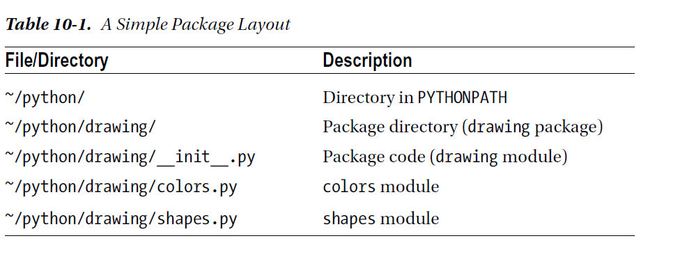
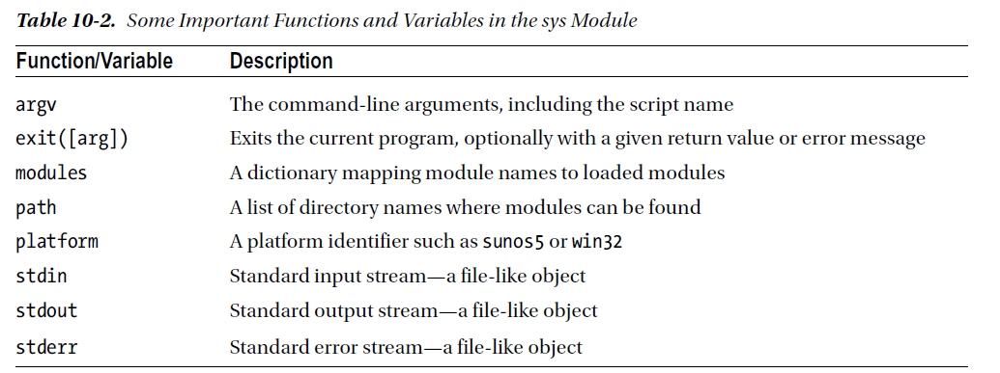
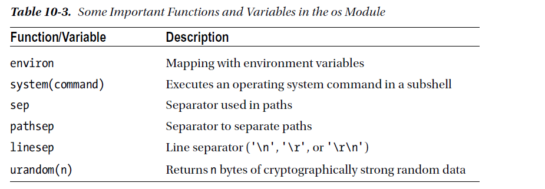
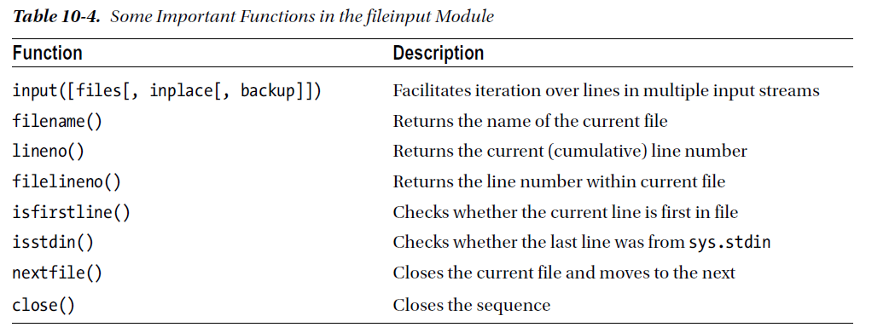
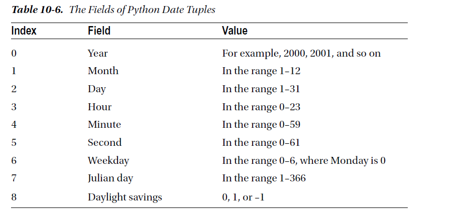
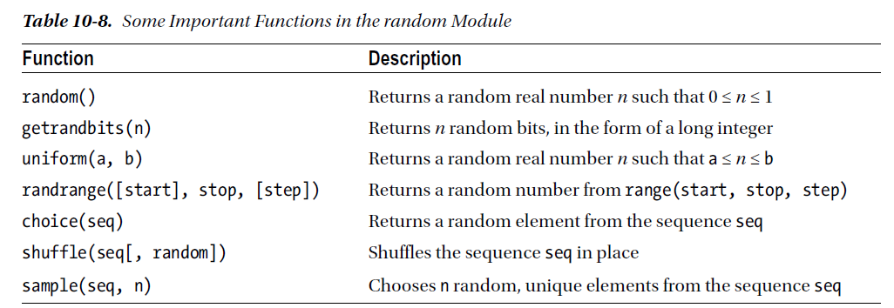
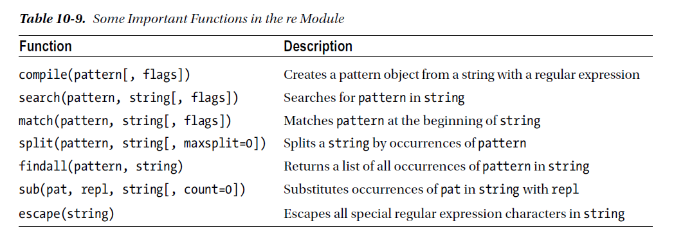
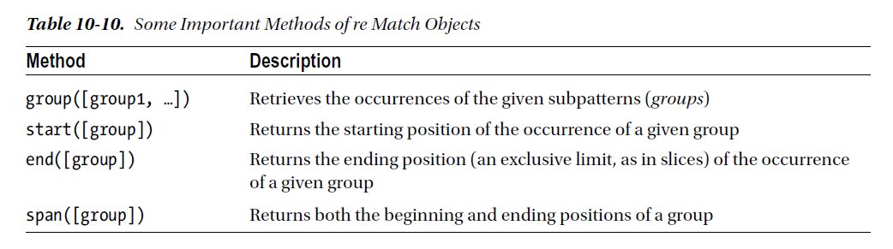
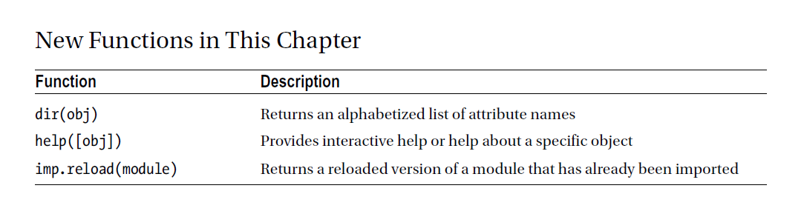

chapter 10: Balanced Binary Search Trees
============================================
지금까지 파이썬의 대부분을 알아보았다.
그것 자체만으로 막강한 힘을 가지지만 파이썬은 좀더 다룰 수 있는 툴을 제공한다.
표준 인스톨 버젼은 표준 라이브러리라고 불리는 모듈을 포함한다.
당신은 그것들을 봐왔다.(math,cmath)
이장에서는 어떻게 모듈이 동작하고 그것을 탐색하며 무엇을 제공할지 배운다.
이 장은 선택된 유용한 모듈을 중심으로 스탠다드 라이브러리에 대한 오버뷰를 제공한다.

10.1 Modules
-------------------
이미 당신의 프로그램을 만드는 것을 알고 있다.
import라는 외부 모듈로부터 당신 프로그램에 넣을 수 있다.

.. code-block:: python

    >>> import math
    >>> math.sin(0)

Modules Are Programs
~~~~~~~~~~~~~~~~~~~~~~

.. code-block:: python

    Listing 10-1. A Simple Module
    # hello.py
    print("Hello, world!")

저장하는것은 중요한 것이다.다음에서 window 또는 unix에 저장하는 것을 알아보자.

.. code-block:: python

    import sys
    sys.path.append('D:/down3')

    import hello

    >>> import importlib
    >>> hello = importlib.reload(hello)

Modules Are Used to Define Things
~~~~~~~~~~~~~~~~~~~~~~~~~~~~~~~~~~~~
모듈은 당신의 프로그램으로 import 되어질 처음에 실행된다.
이것은 유용하다.그러나 아주 유용하지는 않다.
그것들을 의미있게 만드는것은 이후에 그 값을 유지하는 것이다.
그것은 당신이 정의한 어떤 클래스나 함수들,값을 할당하는 변수들이 모듈의 특성이 된다는 것이다.
이것은 좀 복잡할지 모르겠지만, 아주 단순하다.

Defining a Function in a Module
~~~~~~~~~~~~~~~~~~~~~~~~~~~~~~~~
다음 예를 보자.

.. code-block:: python

    def hello():
        print("Hello, world!")

    # import hello2.py
    import hello2
    hello2.hello()

Adding Test Code in a Module
~~~~~~~~~~~~~~~~~~~~~~~~~~~~~~~

.. code-block:: python

    # hello3.py
    def hello():
    print("Hello, world!")
    # A test:
    hello()
    >>> import hello3
    Hello, world!
    >>> hello3.hello()
    Hello, world!

다음 예제를 보자.

.. code-block:: python

    # hello4.py
    def hello():
        print("Hello, world!")

    def test():
        hello()

    if __name__ == '__main__': test()

    >>> import hello4
    >>> hello4.hello()
    hello4.test()

Making Your Modules Available
~~~~~~~~~~~~~~~~~~~~~~~~~~~~~~~

Putting Your Module in the Right Place
~~~~~~~~~~~~~~~~~~~~~~~~~~~~~~~~~~~~~~~~
다음 예제를 보자.

.. code-block:: python

    >>> import sys, pprint
    >>> pprint.pprint(sys.path)

위에서 알 수 있듯이 python path의 site-package 안에 다른 이름으로 넣어도 인식이 가능하다.

.. code-block:: python

    >>> import another_hello
    >>> another_hello.hello()

Telling the Interpreter Where to Look
~~~~~~~~~~~~~~~~~~~~~~~~~~~~~~~~~~~~~~~
올바른 위치에 당신의 모듈을 넣는것은 몇가지 이유로 좋은 솔루션이 아닐 수 있다.

- 당신은 당신의 모듈을 인터프리터가 있는 디렉토리에 산만하게 있길 원하지 않는다.
- 파이썬 인터프리터 디렉토리에 저장하도록 허락하지 않을 것이다.
- 당신의 모듈을 어떤곳에 놓고 싶어할것이다.

당신의 모듈을 특정한 위치에 놓고자 하면 인터프리터에게 그 곳의 위치를 알려줘야 한다.
sys.path로 직접적으로 알려주는 방법도 있지만 그렇게 하는것은 일반적이지 않다.
일반적으로 PYTHONPATH 에 모듈 디렉토리를 포함시키는 것이다.
windows 와 unix계열에 각각 정의하면 된다.
windows 의 경우에는 system path에 정의하면 되고
unix 계열은 .bashrc 에 export PYTHONPATH=$PYTHONPATH:~/python 이런식으로 추가하면 된다.

Packages
~~~~~~~~~~~~~
당신의 모듈을 구조화하기 위하여 당신은 그것들을 패키지로 묶을 수 있다. 패키지는 모듈의 다른 타입이다.
재미있는것은 다른 모듈을 포함할 수 있다는 것이다.모듈이 파일에 저장할때 패키지는 디렉토리이다.
파이썬을 패키지로 다루기 위하여 파일네임앞에 __init__.py 파일 이름을 포함하여야 한다.

예를 들자
constants/__init__.py 패키지 안에 PI=3.14 라고 정의 되어 있다면

import constants
print(constants.PI)

처럼 호출할 수 있다.

다음처럼 호출해서 쓸 수 있다.

import drawing # (1) Imports the drawing package
import drawing.colors # (2) Imports the colors module
from drawing import shapes # (3) Imports the shapes module

10.2 Exploring Modules
--------------------------
스탠다드 라이브러리를 설명하기전에 당신만의 모듈을 찾는것을 알아 보도록 하자.

What’s in a Module?
~~~~~~~~~~~~~~~~~~~~~~~
모듈을 찾는 직접적인 방법은 파이썬 인터프리터 안에서 찾는 것이다.해햐할 첫번째 것은 물론 import 하는 것이다.
표준 라이브러리에 대한 copy를 들었다고 치자.
>>> import copy

exception이 발생하지 않는다.그리고 그것이 존재한다. 그러나 무엇을 할까 그것이 무엇을 포함하고 있을까?

Using dir
~~~~~~~~~~~~~~~
모듈이 포함하고 있는것을 찾기 위하여,dir 함수를 사용할 수 있다.이것은 하나의 object의 특성을 모두 가지고 있다.

.. code-block:: python

    import copy
    >>> [n for n in dir(copy) if not n.startswith('_')]
    ['Error', 'PyStringMap', 'copy', 'deepcopy', 'dispatch_table', 'error', 'name', 't', 'weakref']

The __all__ Variable
~~~~~~~~~~~~~~~~~~~~~
다음 예제를 보자.

.. code-block:: python

    >>> copy.__all__
    ['Error', 'copy', 'deepcopy']

모든 copy 모듈의 함수를 포함하려면 다음처럼 하면 된다.

.. code-block:: python

    from copy import *

Getting Help with help
~~~~~~~~~~~~~~~~~~~~~~~~
다음처럼 하면 해당 모듈에 대한 설명이 나온다.

.. code-block:: python

    >>> help(copy.copy)
    Help on function copy in module copy:
    copy(x)
    Shallow copy operation on arbitrary Python objects.
    See the module's __doc__ string for more info.

    >>> print(copy.copy.__doc__)
    Shallow copy operation on arbitrary Python objects.
    See the module's __doc__ string for more info.

Documentation
~~~~~~~~~~~~~~~
다음처럼 하면 모듈의 문서 내용을 알 수 있다.

.. code-block:: python

    >>> print(range.__doc__)
    range(stop) -> range object
    range(start, stop[, step]) -> range object
    Return an object that produces a sequence of integers from start (inclusive)
    to stop (exclusive) by step. range(i, j) produces i, i+1, i+2, ..., j-1.
    start defaults to 0, and stop is omitted! range(4) produces 0, 1, 2, 3.
    These are exactly the valid indices for a list of 4 elements.
    When step is given, it specifies the increment (or decrement).

Use the Source
~~~~~~~~~~~~~~~~~
문서상 이해할 수 없는 경우 소스를 분석해 보는것도 좋다.
다음 형식으로 열면 된다.

.. code-block:: python

    >>> print(copy.__file__)
    C:\Python35\lib\copy.py

10.3 The Standard Library; A Few Favorites
--------------------------------------------

sys
~~~~~
sys 모듈에서 사용가능한 변수들은 다음과 같다.

sys.argv 변수는 스크립트 이름을 포함하여 interpreter에게 전달되는 전달자를 포함한다.
sys.exit는 현 프로그램을 종료한다.

다음 예를 보자.

.. code-block:: python

    # reverseargs.py
    import sys
    args = sys.argv[1:]
    args.reverse()
    print(' '.join(args))

os
~~~~
os module은 몇가지의 operation system 서비스에 대한 접근을 준다.
os module은 확장적이다.
몇가지 os 모듈에서 유용한 함수와 변수를 다음에 언급했다.

에를 들면 다음처럼 실해이 가능하다.

os.system('/usr/bin/firefox')

os.system(r'C:\"Program Files (x86)"\"Mozilla Firefox"\firefox.exe')

os.startfile(r'C:\Program Files (x86)\Mozilla Firefox\firefox.exe')

fileinput
~~~~~~~~~~
11장에서 파일 처리하는 여러가지 법을 배울 것이다.
fileinput은 라인에 있는 모든 파일을 처리할 수 있게 도와준다.

$ python some_script.py file1.txt file2.txt file3.txt

또는

$ cat file.txt | python some_script.py

fileinput에 대해서 자세히 알아보자.

.. code-block:: python

    # numberlines.py
    import fileinput
    for line in fileinput.input(inplace=True):
    line = line.rstrip()
    num = fileinput.lineno()
    print('{:<50} # {:2d}'.format(line, num))
    If you run this program on itself, like this:
    $ python numberlines.py numberlines.py

Sets, Heaps, and Deques
~~~~~~~~~~~~~~~~~~~~~~~~
파이썬에는 유용한 data 구조들이 많다.

sets
~~~~~
오래전에 sets는 sets 모듈에 Set class로 구현되어졌다.
set은 build-in class로 import 할 필요가 없다.

.. code-block:: python

    >>> set(range(10))
    {0, 1, 2, 3, 4, 5, 6, 7, 8, 9}

    >>> type({})
    <class 'dict'>

.. code-block:: python

    >>> {0, 1, 2, 3, 0, 1, 2, 3, 4, 5}
    {0, 1, 2, 3, 4, 5}

전달자 없이 set을 호출할 필요가 있다.중요 사용법은 멤버쉽을 결정하는것이다. 그래서 중복은 무시된다.
dictionaries와 같이 element set의 순서는 매우 임의적이다.그리고 의존적이지 말아야 한다.

.. code-block:: python

    >>> {'fee', 'fie', 'foe'}
    {'foe', 'fee', 'fie'}

멤버쉽을 체크하는것과 더불어 union 이나 intersection 등의 다양한 표준 동작들을 할 수 있다.
다음 예를 보자.

.. code-block:: python

    >>> a = {1, 2, 3}
    >>> b = {2, 3, 4}
    >>> a.union(b)
    {1, 2, 3, 4}
    >>> a | b
    {1, 2, 3, 4}

다음 예를 보자.

.. code-block:: python

    a = {1, 2, 3}
    b = {2, 3, 4}
    print(a.union(b))
    print(a|b)

    c=a&b
    print(c)
    print(c.issubset(a))
    print(c.issuperset(a))

    print(c>=a)

    print(a.intersection(b))

    print(a & b)

    print(a.difference(b))

    print(a - b)

    print(a.symmetric_difference(b))

    print(a ^ b)

    print(a.copy())

    print(a.copy() is a)

sets은 mutable이기때문에 dictionary 에서 key처럼 쓰이지 않을지도 모르겠다.
또다른 문제는 sets 자체로는 유일한 immutable 값을 가지기때문에 다른 sets 값을 포함하지 않을 지 모르겠다.
sets of sets 가 종종 쓰이기때문에 이것은 문제가 된다. immutable sets를 표현하는 frozenset type도 있다.
예를 보자.

.. code-block:: python

    >>> a = set()
    >>> b = set()
    >>> a.add(b)
    Traceback (most recent call last):
    File "<stdin>", line 1, in ?
    TypeError: set objects are unhashable
    >>> a.add(frozenset(b))

Heaps
~~~~~~~~~~
또다른 잘 알려진 data 구조는 heap이다.  큐 우선권과 같은 것이다.
우선권 queue 는 object를 임의의 순서로 추가한다.그리고 언제라도 가장 작은 element를 찾는다.
이것은 list에서 min을 사용하는 것보다 쉽다.
사실 파이썬에는 구분되는 heap type이 없다. 유일하게 heap-manuplating function만 존재한다.
이러한 모듈을 heapq 라고 불리우고 여섯개의 함수를 포함한다.
다음예를 보자.

.. code-block:: python

    from heapq import *
    from random import shuffle
    data = list(range(10))
    shuffle(data)
    heap = []
    for n in data:
        heappush(heap, n)

    print(heap)

    print(heappush(heap, 0.5))
    print(heap)

    print(heappop(heap))

    print(heappop(heap))

    print(heappop(heap))

    print(heap)

다음 예처럼 heappop은 가장 작은 element부터 나오게 된다.

heapify 함수는 임의의 리스트를 취하고 최소한의 suffle을 통해 legal heap로 만든다.
heappush 와 heappop 사용하기 시작하기 전에 사용한다.

.. code-block:: python

    ###heapify

    heap = [5, 8, 0, 3, 6, 7, 9, 1, 4, 2]
    heapify(heap)
    print(heap)

    heapify(heap)
    print(heap)

    ##heapreplace
    heapreplace(heap, 0.5)
    print(heap)
    heapreplace(heap, 10)

    print(heap)

heapq 모듈의 나머지 함수는 nlargest(n,iter) , nsmallist(n,iter) n largest or smallest element들이다.

Deques (and Other Collections)
~~~~~~~~~~~~~~~~~~~~~~~~~~~~~~~
다음 예를 보자.

.. code-block:: python

    from collections import deque
    q = deque(range(5))
    q.append(5)
    q.appendleft(6)
    print(q)
    deque([6, 0, 1, 2, 3, 4, 5])
    print(q.pop())

    print(q.popleft())

    q.rotate(3)
    print(q)

    q.rotate(-1)
    print(q)

time
~~~~~~~
time 모듈은 다음과 같은 함수를 포함한다.

.. code-block:: python

    >>> time.asctime()
    'Mon Jul 18 14:06:07 2016'

random
~~~~~~~~~~
random 모듈은 랜덤 숫자를 리턴하는 함수들을 포함한다.
시뮬레이션이나 랜덤 아웃풋을 만드는 프로그램에 유용하다.

다음 예를 보자.

.. code-block:: python

    from random import *
    from time import *
    date1 = (2016, 1, 1, 0, 0, 0, -1, -1, -1)
    time1 = mktime(date1)
    date2 = (2017, 1, 1, 0, 0, 0, -1, -1, -1)
    time2 = mktime(date2)

    random_time = uniform(time1, time2)
    print(asctime(localtime(random_time)))

주사위 던지기 메카니즘은 randrange 와 for loop로 만들어 진다.

.. code-block:: python

    from random import randrange
    num = int(input('How many dice? '))
    sides = int(input('How many sides per die? '))
    sum = 0
    for i in range(num): sum += randrange(sides) + 1
    print('The result is', sum)

shelve and json
~~~~~~~~~~~~~~~~
skip

A Potential Trap
~~~~~~~~~~~~~~~~~~
shelve.open으로 리턴되는 object는 일상의 mapping이 아니라는 것을 아는것이 중요하다.

다음 예를 보자.

.. code-block:: python

    # database.py
    import sys, shelve

    def store_person(db):
        """
        Query user for data and store it in the shelf object
        """
        pid = input('Enter unique ID number: ')
        person = {}
        person['name'] = input('Enter name: ')
        person['age'] = input('Enter age: ')
        person['phone'] = input('Enter phone number: ')
        db[pid] = person

    def lookup_person(db):
        """
        Query user for ID and desired field, and fetch the corresponding data from
        the shelf object
        """
        pid = input('Enter ID number: ')
        field = input('What would you like to know? (name, age, phone) ')
        field = field.strip().lower()

        print(field.capitalize() + ':', db[pid][field])

    def print_help():
        print('The available commands are:')
        print('store  : Stores information about a person')
        print('lookup : Looks up a person from ID number')
        print('quit   : Save changes and exit')
        print('?      : Prints this message')

    def enter_command():
        cmd = input('Enter command (? for help): ')
        cmd = cmd.strip().lower()
        return cmd

    def main():
        database = shelve.open('C:\\database.dat') # You may want to change this name
        try:
            while True:
                cmd = enter_command()
                if  cmd == 'store':
                    store_person(database)
                elif cmd == 'lookup':
                    lookup_person(database)
                elif cmd == '?':
                    print_help()
                elif cmd == 'quit':
                    return
        finally:
            database.close()

    if name == '__main__': main()

What Is a Regular Expression?
~~~~~~~~~~~~~~~~~~~~~~~~~~~~~~~

Contents of the re Module
~~~~~~~~~~~~~~~~~~~~~~~~~
다음을 보자.

.. code-block:: python

    import re

    some_text1='test,beta,,,,,gama,pat,delta'

    print(re.search(some_text1,'pat'))

    some_text = 'alpha, beta,,,,gamma delta'
    print(re.split('[, ]+', some_text))

    print(re.split('[, ]+', some_text, maxsplit=2))

    print(re.split('[, ]+', some_text, maxsplit=1))

    pat = '[a-zA-Z]+'
    text = '"Hm... Err -- are you sure?" he said, sounding insecure.'
    print(re.findall(pat, text))

    pat = r'[.?\-",]+'
    print(re.findall(pat, text))

    pat = '{name}'
    text = 'Dear {name}...'
    print(re.sub(pat, 'Mr. Gumby', text))

Match Objects and Groups
~~~~~~~~~~~~~~~~~~~~~~~~~~~

다음 예를 보자

.. code-block:: python

    import re

    m = re.match(r'www\.(.*)\..{3}', 'www.python.org')

    print(m.group(1))

    print(m.start(1))

    print(m.end(1))

    print(m.span(1))

Group Numbers and Functions in Substitutions
~~~~~~~~~~~~~~~~~~~~~~~~~~~~~~~~~~~~~~~~~~~~~~
skip

다음 예를 보자.

.. code-block:: python

    # find_sender.py
    import fileinput, re
    pat = re.compile('From: (.*) <.*?>$')
    for line in fileinput.input():
        m = pat.match(line)
        if m: print(m.group(1))

A Sample Template System
~~~~~~~~~~~~~~~~~~~~~~~~~~~
template은 완성된 text 종류를 얻기위해 특별한 값을 넣을 수 있는 파일이다.

다음 예를 보자.

.. code-block:: python

    # templates.py

    import fileinput, re

    # Matches fields enclosed in square brackets:
    field_pat = re.compile(r'\[(.+?)\]')

    # We'll collect variables in this:
    scope = {}

    # This is used in re.sub:
    def replacement(match):
        code = match.group(1)
        try:
            # If the field can be evaluated, return it:
            return str(eval(code, scope))
        except SyntaxError:
            # Otherwise, execute the assignment in the same scope ...
            #exec code in scope
            # ... and return an empty string:
            return ''

    # Get all the text as a single string:

    # (There are other ways of doing this; see Chapter 11)
    lines = []
    for line in fileinput.input():
        lines.append(line)
    text = ''.join(lines)

    # Substitute all the occurrences of the field pattern:
    print(field_pat.sub(replacement, text))

Other Interesting Standard Modules
~~~~~~~~~~~~~~~~~~~~~~~~~~~~~~~~~~~~~~

argparse:

cmd:

csv:

datetime:

difflib:

enum:

functools:

itertools:

logging:

statistics:

timeit, profile, and trace:

10.4 A Quick Summary
------------------------

Modules:
~~~~~~~~~~~~
A module is basically a subprogram whose main function is to define
things, such as functions, classes, and variables. If a module contains any test
code, it should be placed in an if statement that checks whether name == '__
main__'. Modules can be imported if they are in the PYTHONPATH. You import a
module stored in the file foo.py with the statement import foo.
Packages:
~~~~~~~~~~
A package is just a module that contains other modules. Packages are
implemented as directories that contain a file named __init__.py.
Exploring modules: After you have imported a module into the interactive
interpreter, you can explore it in many ways. Among them are using
dir, examining the __all__ variable, and using the help function. The
documentation and the source code can also be excellent sources of information
and insight.
The standard library:
~~~~~~~~~~~~~~~~~~~~~~
Python comes with several modules included, collectively
called the standard library. Some of these were reviewed in this chapter:

New Function
~~~~~~~~~~~~~~~

