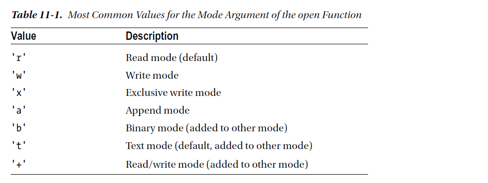
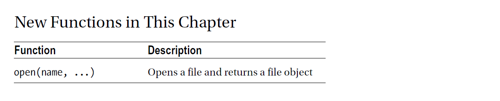

chapter 11: Getting the Right Web Page
===========================================
이 장에서는 file stream에 대해서 얘기를 하겠다.

Opening Files
~~~~~~~~~~~~~~
open 함수는 io module에 존재하는데 자동으로 import 되어진다.
다음 예제를 보자.

.. code-block:: python

    >>> f = open('somefile.txt')

File Modes
~~~~~~~~~~~~~~~
파일은 다음과 같이 모드가 설정된다.

11.1 Opening Files
-------------------

11.2 The Basic File Methods
--------------------------------

Reading and Writing
~~~~~~~~~~~~~~~~~~~~~
파일의 가장 중요한 역할은 데이터를 주고 받는 것이다. f라고 이름지어지는 file가 같은 object를 가지고 있다면
f.write로 데이터를 쓰고 f.read로 데이터를 읽을 수 있다.

Piping Output
~~~~~~~~~~~~~~~~
skip

다음 예를 보자

.. code-block:: python

    f = open(r'D:\down3\somefile.txt', 'w')
    f.write('01234567890123456789')
    f.seek(5)
    f.write('Hello, World!')
    f.close()
    f = open(r'D:\down3\somefile.txt')
    f.read()

여기서 seek 함수는 해당 포지션으로 이동하는 함수이다.
다음 예처럼 read를 하게되면 해당 포지션으로 움직인다.

.. code-block:: python

    f =open(r'D:\down3\somefile.txt')

    print(f.read(3))

    print(f.read(2))

Reading and Writing Lines
~~~~~~~~~~~~~~~~~~~~~~~~~~~~
실제로 이제껏 했던것은 약간은 불필요한 것일것이다. 편지를 읽는것처럼 line stream을 읽듯이 할 수 있다.
readline method로 라인 전체를 읽을 수 있다.
이것은 어떤 argument가 없더라도 가능하다.
somefile.txt를  readline() 하면 라인 전체를 readline(5) 부분만 표시된다.

.. code-block:: python

    f = open(r'D:\down3\somefile.txt', 'w')
    f.write('01234567890123456789')
    f.seek(5)
    f.write('Hello, World!')
    f.close()
    f = open(r'D:\down3\somefile.txt')
    print(f.read())

    f =open(r'D:\down3\somefile.txt')

    print(f.read(3))

    print(f.read(2))

    print(f.readline())

    print(f.readline(5))

writelines는 readlines의 반대이다.

Closing Files
~~~~~~~~~~~~~~~
close method를 이용하여 file을 닫아야만 한다.보통 file object는 프로그램을 종료할때 자동으로 닫힌다. 진실로 중요하지 않은
파일은 닫지 않는다.
파일을 닫는다는 것은 손해를 입히지 않고 어떤 OS 시스템에서 파일을 불필요하게 잠금을 막아준다.
파이썬은 당신이 쓰고자 하는 데이터를 버퍼링하고 있기때문에 쓰고자 하는 파일을 닫아야 한다.
만약 당신의 프로그램이 어떤 상황에서 깨졌다고 한다면,그 데이터는 그 파일에 전혀 쓸 수가 없다.
안전한 것은 그것을 끝마쳤을경우 파일을 닫아주어야 하는 것이다.
파일을 열때는 다음처럼 try /finally를 이용하여 처리한다.

.. code-block:: python

    # Open your file here
    try:
    # Write data to your file
    finally:
    file.close()

Using the Basic File Methods
~~~~~~~~~~~~~~~~~~~~~~~~~~~~~~

다음 예를 보자

.. code-block:: python

    f=open(r'D:\down\listing11-3.txt')

    print(f.read(7))
    print(f.read(4))

    f=open(r'D:\down\listing11-3.txt')

    print(f.read())

    f=open(r'D:\down\listing11-3.txt')

    for i in range(3):
        print(str(i)+':'+f.readline(),end='')

    print('\n')
    f=open(r'D:\down\listing11-3.txt')

    for i in range(3):
        print(f.readline())

다음처럼 처리할 수도 있다.

.. code-block:: python

    import pprint

    pprint.pprint(open(r'D:₩down₩listing11-3.txt').readline())

11.3 Iterating over File Contents
----------------------------------------

One Character (or Byte) at a Time
~~~~~~~~~~~~~~~~~~~~~~~~~~~~~~~~~
다음 예제를 보자.

.. code-block:: python

    with open(r'D:\down\listing11-5.txt') as f:
        char = f.read(1)
        while char:
            #process(char)
            print(str(char))
            char = f.read(1)

 One Line at a Time
~~~~~~~~~~~~~~~~~~~~~~
다음 예제를 보자.

.. code-block:: python

    with open(r'D:\down\listing11-5.txt') as f:
        while True:
            line = f.readline()
            if not line: break
            #process(line)
            print(line)
Reading Everything
~~~~~~~~~~~~~~~~~~~~~
다음 예제를 보자.

.. code-block:: python

    with open(filename) as f:
        for char in f.read():
            process(char)

    with open(filename) as f:
        for line in f.readlines():
            process(line)

Lazy Line Iteration with fileinput
~~~~~~~~~~~~~~~~~~~~~~~~~~~~~~~~~
다음 예제를 보자.

.. code-block:: python

    import fileinput
    for line in fileinput.input(filename):
        process(line)

File Iterators
~~~~~~~~~~~~~~~~~~
다음 예제를 보자.
Iterating over a File

.. code-block:: python

    with open(filename) as f:
        for line in f:
            process(line)

Iterating over a File Without Storing the File Object in a Variable

.. code-block:: python

    for line in open(filename):
        process(line)

sys.stdin is iterable

.. code-block:: python

    import sys
    for line in sys.stdin:
    process(line)

11.4 A Quick Summary
----------------------------------------

File-like objects:
~~~~~~~~~~~~~~~~~~~
A file-like object is (informally) an object that supports a set of
methods such as read and readline (and possibly write and writelines).
Opening and closing files:
~~~~~~~~~~~~~~~~~~~~~~~~~~~
You open a file with the open function, by supplying
a file name. If you want to make sure your file is closed, even if something goes
wrong, you can use the with statement.

New Functions
~~~~~~~~~~~~~~~

