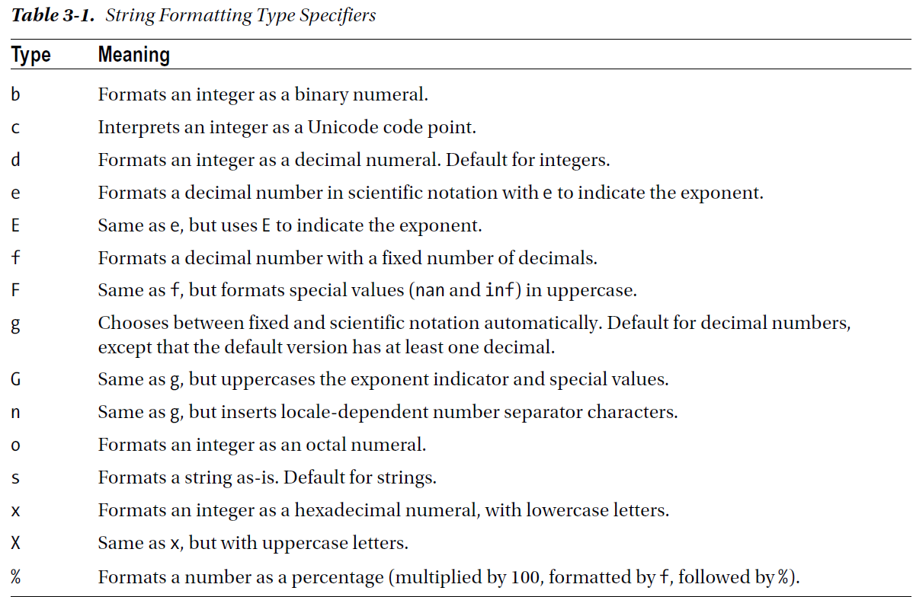

chapter 3: Using Python to Work with Algorithms
=====================================================

3.1 Basic String Operations
------------------------------
모든 표준 sequence 연산자는(indexing, slicing, multiplication, membership, length, minimum,
and maximum) String과 함께 쓰인다.
string은 변경할 수 없다.따라서 item에 대한 모는것과 slic 할당은 쓸 수 없다.

.. code-block:: python

    >>> website = 'http://www.python.org'
    >>> website[-3:] = 'com'
    Traceback (most recent call last):
    File "<pyshell#19>", line 1, in ?
    website[-3:] = 'com'
    TypeError: object doesn't support slice assignment

3.2 String Formatting: The Short Version
-----------------------------------------
여기서는 string format에 대한 간략한 버젼을 보도록 하자. 상세한 것은 String Formatting 버젼을 찾아 보도록 하자.
string으로서 값을 표현하는것은 중요한 부분이다.

다음 예를 보도록 하자.

.. code-block:: python

    >>> format = "Hello, %s. %s enough for ya?"
    >>> values = ('world', 'Hot')
    >>> format % values
    'Hello, world. Hot enough for ya?

%s 연산자는 변환 특별자로 불리는 format string의 일부분이다.
그것은 값이 넣어지는 곳에  표시된다.
s의 의미는 string으로 형태를 하도록 되어져야만 한다.그렇지 않으면 그것은 str으로 변환될것이다.
%.3f의 경우는 3자릿수 float 숫자값으로 표현된다.
또다른 솔루션은 다음처럼 template을 사용하는것이다.

.. code-block:: python

    >>> from string import Template
    >>> tmpl = Template("Hello, $who! $what enough for ya?")
    >>> tmpl.substitute(who="Mars", what="Dusty")
    'Hello, Mars! Dusty enough for ya?'

다음처럼 format을 이용하여 표현할 수 있다.

.. code-block:: python

    >>> "{}, {} and {}".format("first", "second", "third")
    'first, second and third'
    >>> "{0}, {1} and {2}".format("first", "second", "third")
    'first, second and third'

    >>> "{3} {0} {2} {1} {3} {0}".format("be", "not", "or", "to")
    'to be or not to be'

다음처럼 표현될 수 있다.

.. code-block:: python

    >>> from math import pi
    >>> "{name} is approximately {value:.2f}.".format(value=pi, name="π")
    'π is approximately 3.14.'

만약 값이 특정되지 않으면 다음처럼 표현된다.

.. code-block:: python

    >>> "{name} is approximately {value}.".format(value=pi, name="π")
    'π is approximately 3.141592653589793.'

python 3.6에서는 대체되는 필드에 상응하는 동일한 이름을 가진 변수를 가질때 쓸 수 있는 숏컷이 있다.
그러한 경우 f로 시작하는 so-called-string이라고 한다.

.. code-block:: python

    >>> from math import e
    >>> f"Euler's constant is roughly {e}."
    "Euler's constant is roughly 2.718281828459045."

3.3 String Formatting: The Long Version
-----------------------------------------
format string은 모든 것이 옵션인 field name,ocnversation flag,format specifier등으로 구성된 교체필드에서 발견된다.

Replacement Field Names
~~~~~~~~~~~~~~~~~~~~~~~~
다음처럼 지정된 필드와 지정되지 않은 필드가 있을때 나타나는 것을 보자.

.. code-block:: python

    >>> "{foo} {} {bar} {}".format(1, 2, bar=4, foo=3)
    '3 1 4 2'

    >>> "{foo} {1} {bar} {0}".format(1, 2, bar=4, foo=3)
    '3 2 4 1'

지정되지 않은 필드에 대한 순서를 바뀌어 나오게 할 수도 있다.

수동,자동 숫자 매기기의 혼합은 허용이 안된다.
어찌됐건 혼란을 일으킨다.
그것 자체로 할당된 값을 사용하지 말아야 한다.그것들의 일부로서 접근할 수 있다.

.. code-block:: python

    >>> fullname = ["Alfred", "Smoketoomuch"]
    >>> "Mr {name[1]}".format(name=fullname)
    'Mr Smoketoomuch'
    >>> import math
    >>> tmpl = "The {mod.__name__} module defines the value {mod.pi} for π"
    >>> tmpl.format(mod=math)
    'The math module defines the value 3.141592653589793 for π'

Basic Conversions
~~~~~~~~~~~~~~~~~~~
특별한 필드가 포함된다면 어떻게 포맷을 할 수 있는지 지시를 할 수 있다.
일단 변환 플래그를 제공할 수 있다.

.. code-block:: python

    >>> print("{pi!s} {pi!r} {pi!a}".format(pi="π"))
    π 'π' '\u03c0'

여기서 s,r,a는 각각 str,replr,ascii로 구분된다.
또한 값의 타입을 변경할 수 있다.

.. code-block:: python

    >>> "The number is {num}".format(num=42)
    'The number is 42'
    >>> "The number is {num:f}".format(num=42)
    'The number is 42.000000'
첫번째는 integer값을 넣었지만 decimal 값으로 표시되었고 두번째는 :f를 넣어(fixed point) 로 표현되었다.

다음처럼 바이너리 표현으로 할 수도 있다.

.. code-block:: python

    >>> "The number is {num:b}".format(num=42)
    'The number is 101010'

Width, Precision, and Thousands Separators
~~~~~~~~~~~~~~~~~~~~~~~~~~~~~~~~~~~~~~~~~~~~~~~~~~
다음을 보자
넓이는 정수로 다음처럼 표현된다.

.. code-block:: python

    >>> "{num:10}".format(num=3)
    ' 3'
    >>> "{name:10}".format(name="Bob")
    'Bob '

본것과 같이 숫자와 스트링은 약간 다르게 할당된다. 다음장에서 다시 한번 보도록 하자.
프리시젼도 또한 정수로 표현할 수 있다.다음 예를 보도록 하자.

.. code-block:: python

    >>> "Pi day is {pi:.2f}".format(pi=pi)
    'Pi day is 3.14'

 width와 precision을 동시에 쓸 수도 있다.

.. code-block:: python

    >>> "{pi:10.2f}".format(pi=pi)
    ' 3.14'
다른 타입으로 precision을 사용할 수 있다. 이러한 것은 자주 쓰이지는 않는다.

.. code-block:: python

    >>> "{:.5}".format("Guido van Rossum")
    'Guido'

다음처럼 ,를 통해 표현할 수 있다.

.. code-block:: python

    >>> 'One googol is {:,}'.format(10**100)
    'One googol is 10,000,000,000,000,000,000,000,000,000,000,000,000,000,000,000,000,000,000,00
    0,000,000,000,000,000,000,000,000,000,000,000,000,000,000'

이러한 ,는 width와 period indicating precision 사이에 존재해야 한다.

Signs, Alignment, and Zero-Padding
~~~~~~~~~~~~~~~~~~~~~~~~~~~~~~~~~~~~~
다음처럼 zero-padding 할 수 있다.

.. code-block:: python

    >>> '{:010.2f}'.format(pi)
    '0000003.14'

다음처럼 <, >, and ^ 왼쪽 오픈쪽 가운데를 표시할 수 있다.

.. code-block:: python

    >>> print('{0:<10.2f}\n{0:^10.2f}\n{0:>10.2f}'.format(pi))
    3.14
        3.14
            3.14

스페이스 캐릭터 대신에 특정 문자를 표현하도록 할당 할 수 있다.

.. code-block:: python

    >>> "{:$^15}".format(" WIN BIG ")
    '$$$ WIN BIG $$$'
sign과 digit 사이에 어떤 문자를 채울 수 있는 = 도 있다.

.. code-block:: python

    >>> print('{0:10.2f}\n{1:10.2f}'.format(pi, -pi))
    3.14
    -3.14
    >>> print('{0:10.2f}\n{1:=10.2f}'.format(pi, -pi))
    3.14
    - 3.14

    >>> print('{0:-.2}\n{1:-.2}'.format(pi, -pi)) # Default
    3.1
    -3.1
    >>> print('{0:+.2}\n{1:+.2}'.format(pi, -pi))
    +3.1
    -3.1
    >>> print('{0: .2}\n{1: .2}'.format(pi, -pi))
    3.1
    -3.1

마지막으로 # 옵션이다.(sign 과 width 옵션 사이)

.. code-block:: python

    >>> "{:b}".format(42)
    '101010'
    >>> "{:#b}".format(42)
    '0b101010'

    >>> "{:g}".format(42)
    '42'
    >>> "{:#g}".format(42)
    '42.0000'

다음 예제을 보자.
Listing 3-1. String Formatting Example

.. code-block:: python

    # Print a formatted price list with a given width
    width = int(input('Please enter width: '))
    price_width = 10
    item_width = width - price_width
    header_fmt = '{{:{}}}{{:>{}}}'.format(item_width, price_width)
    fmt = '{{:{}}}{{:>{}.2f}}'.format(item_width, price_width)
    print('=' * width)
    print(header_fmt.format('Item', 'Price'))
    print('-' * width)
    print(fmt.format('Apples', 0.4))
    print(fmt.format('Pears', 0.5))
    print(fmt.format('Cantaloupes', 1.92))
    print(fmt.format('Dried Apricots (16 oz.)', 8))
    print(fmt.format('Prunes (4 lbs.)', 12))
    print('=' * width)

3.4 String Methods
-------------------
string 메쏘드는 string 모듈에서 상속을 받았기때문에 좀더 많은 함수를 포함하고 있다.
많은 string 함수들이 있지만 여기서는 몇가지 중요한 함수들만 정리하자.
string 모듈은 string 함수에서 쓰이지 않은 몇가지 상수와 함수들이 있다.

다음은 string으로부터 가능한 상수들이다.

• string.digits: A string containing the digits 0–9
• string.ascii_letters: A string containing all ASCII letters (uppercase and lowercase)
• string.ascii_lowercase: A string containing all lowercase ASCII letters
• string.printable: A string containing all printable ASCII characters
• string.punctuation: A string containing all ASCII punctuation characters
• string.ascii_uppercase: A string containing all uppercase ASCII letters

center
~~~~~~~~~~~~
다음 예처럼 공란이나 기호를 넣어 처리할 수 있다.

.. code-block:: python

    >>> "The Middle by Jimmy Eat World".center(39)
    ' The Middle by Jimmy Eat World '
    >>> "The Middle by Jimmy Eat World".center(39, "*")
    '*****The Middle by Jimmy Eat World*****'

find
~~~~~~~~~~~~
커다란 string에서 하위 string을 찾아내는 함수이다.

.. code-block:: python

    >>> 'With a moo-moo here, and a moo-moo there'.find('moo')
    7
    >>> title = "Monty Python's Flying Circus"
    >>> title.find('Monty')
    0
    >>> title.find('Python')
    6
    >>> title.find('Flying')
    15
    >>> title.find('Zirquss')
    -1
다음처럼 옵션을 넣어서 순서를 찾을 수 있다.

.. code-block:: python

    >>> subject = '$$$ Get rich now!!! $$$'
    >>> subject.find('$$$')
    0
    >>> subject.find('$$$', 1) # Only supplying the start
    20
    >>> subject.find('!!!')
    16

시작과 끝을 지정할 수 있다.

.. code-block:: python

    >>> subject.find('!!!', 0, 16) # Supplying start and end
    -1

join
~~~~~~~~~~~~

다음처럼 string  sequence에 대해 다음처럼 쓸 수 있다.

 .. code-block:: python

     >>> seq = [1, 2, 3, 4, 5]
    >>> sep = '+'
    >>> sep.join(seq) # Trying to join a list of numbers
    Traceback (most recent call last):
    File "<stdin>", line 1, in ?
    TypeError: sequence item 0: expected string, int found
    >>> seq = ['1', '2', '3', '4', '5']
    >>> sep.join(seq) # Joining a list of strings
    '1+2+3+4+5'
    >>> dirs = '', 'usr', 'bin', 'env'
    >>> '/'.join(dirs)
    '/usr/bin/env'
    >>> print('C:' + '\\'.join(dirs))
    C:\usr\bin\env

lower
~~~~~~~~~~~~
lower 함수는 string의 소문자로 리턴하는 것이다.

 .. code-block:: python

    >>> 'Trondheim Hammer Dance'.lower()
    'trondheim hammer dance'

다음처럼 하면 대소문자를 구분하지 못하여 찾지를 못한다.

 .. code-block:: python

    >>> if 'Gumby' in ['gumby', 'smith', 'jones']: print('Found it!')

그래서 다음처럼 대소문자를 변경후 찾으면  된다.

 .. code-block:: python

    >>> name = 'Gumby'
    >>> names = ['gumby', 'smith', 'jones']
    >>> if name.lower() in names: print('Found it!')

 이와 반대로 title 함수는 첫글자는 대문자로 변환하는 함수이다.

 .. code-block:: python

    >>> "that's all folks".title()
    "That'S All, Folks"

또다른 방법으로 capword 가 있다.

 .. code-block:: python

    >>> import string
    >>> string.capwords("that's all, folks")
    That's All, Folks"

replace
~~~~~~~~~~~~
string에서 대체하는 함수이다.

 .. code-block:: python

    >>> 'This is a test'.replace('is', 'eez')
    'Theez eez a test'

split
~~~~~~~~~~~~
join에 반대되는 함수이다.

 .. code-block:: python

    >>> '1+2+3+4+5'.split('+')
    ['1', '2', '3', '4', '5']
    >>> '/usr/bin/env'.split('/')
    ['', 'usr', 'bin', 'env']
    >>> 'Using the default'.split()
    ['Using', 'the', 'default']

strip
~~~~~~~~~~~~
string 왼쪽,오른쪽 공백을 지우는 함수이다.

 .. code-block:: python

    >>> ' internal whitespace is kept '.strip()
    'internal whitespace is kept'

다음의 경우처럼 공백이 있는 string을 비교할때 공백을 빼고 처리하는 함수이다.

 .. code-block:: python

    >>> names = ['gumby', 'smith', 'jones']
    >>> name = 'gumby '
    >>> if name in names: print('Found it!')
    ...
    >>> if name.strip() in names: print('Found it!')
    ...
    Found it!
    >>>

translate
~~~~~~~~~~~~
replace와 동일한 역할을 하지만 단일 문자에 대해서만 쓴다. 이런경우는 여려개의 대체를 할 경우에 유용하다.
translate를 사용하기전에 translate table을 만들어야 한다.유니코드에 대한 변환될 정보가 들어 있다.
maketrans 함수를 이용하여 이러한 translate table을 만들 수 있다.

다음 예를 보자.

 .. code-block:: python

    >>> table = str.maketrans('cs', 'kz')

    >>> table
    {115: 122, 99: 107}

    >>> 'this is an incredible test'.translate(table)
    'thiz iz an inkredible tezt'

다음처럼 3번째 옵션을 넣어서 특정 문자를 지울 수 있다.

 .. code-block:: python

    >>> table = str.maketrans('cs', 'kz', ' ')
    >>> 'this is an incredible test'.translate(table)
    'thizizaninkredibletezt'

3.5 A Quick Summary
------------------------
이 장에서는 다음을 배웠다.

String formatting

String methods

New Function in this chapter
~~~~~~~~~~~~~~~~~~~~~~~~~~~~~~

string.capwords(s[, sep])

ascii(obj)

