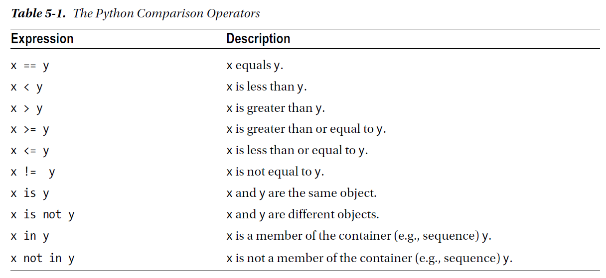
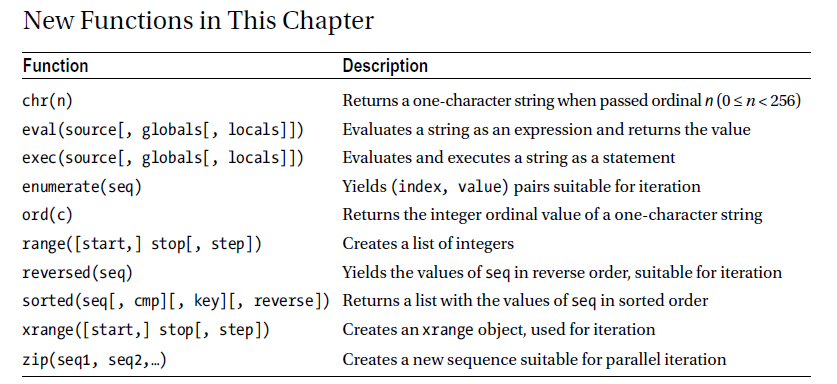

chapter 5: Performing Essential Data Manipulations Using Python
===================================================================
지금까지는 좀 더 힘든 부분을 다루었다. 모든 데이터 타입은 멋쟁이이다. 그것으로 충분할까요?
약간 페이스를 올려봅시다. conditionals 과 loop를 살펴보기전에 잠깐 기본 용법에 대하 알아 봅시다.

5.1 More About print and import
----------------------------------------
여기서는 print문과 import의 다른 특성들을 알아보도록 하자.

Printing Multiple Arguments
~~~~~~~~~~~~~~~~~~~~~~~~~~~~~~~
print는 어떤 string 또는 어떤 하나로 변환된 표현을 나타낼때 쓰인다.
print는 ,로 구분을 하면  한개이상 표현을 할 수 있다.

.. code-block:: python

    >>> print('Age:', 42)

보다시피 스페이스 문자가 각 전달자 사이에 들어간다.이것은 유용할때가 있는데 text와 변수값을 string format을 쓰지 않고 쓸 수 있다.

.. code-block:: python

    >>> name = 'Gumby'
    >>> salutation = 'Mr.'
    >>> greeting = 'Hello,'
    >>> print(greeting, salutation, name)
    Hello, Mr. Gumby

첫번째처럼 쓰이게 되면 스페이스값이 들어가기 때문에 두번째처럼 써야 된다.

.. code-block:: python

    >>> name = 'Gumby'
    >>> salutation = 'Mr.'
    >>> greeting = 'Hello'
    print(greeting, ',', salutation, name)
    >>>Hello , Mr gumby
    print(greeting + ',', salutation, name)
    >>>Hello, Mr gumby

또한 특정 구분자를 넣어도 된다.

.. code-block:: python

    >>> print("I", "wish", "to", "register", "a", "complaint", sep="_")
    I_wish_to_register_a_complaint

다음처럼 특정 end string을 넣어도 된다.

.. code-block:: python

    print('Hello,', end='')
    print('world!')

Importing Something as Something Else
~~~~~~~~~~~~~~~~~~~~~~~~~~~~~~~~~~~~~~~
보통 다음처럼 import를 사용한다.

.. code-block:: python

    import somemodule
    or use
    from somemodule import somefunction
    or
    from somemodule import somefunction, anotherfunction, yetanotherfunction
    or
    from somemodule import *

네번째의 경우는 주어진 모듈의 모든것을 쓰고자할때만 쓰여져야 한다.
만약 2개 모듈을 중에 동일한 함수가 있을 경우에는 다음처럼 사용해야 한다.

.. code-block:: python

    module1.open(...)
    module2.open(...)

다음처럼 모듈 전체를 as로 처리해서 쓰일수도 있다.

.. code-block:: python

    >>> import math as foobar
    >>> foobar.sqrt(4)
    2.0

또는

.. code-block:: python

    >>> from math import sqrt as foobar
    >>> foobar(4)
    2.0
open 함수에 대해서 다음처럼 사용할 수 있다.

.. code-block:: python

    from module1 import open as open1
    from module2 import open as open2

5.2 Assignment Magic
-----------------------

Sequence Unpacking
~~~~~~~~~~~~~~~~~~~~
다음처럼 할당할 수 있다.

.. code-block:: python

    x,y,z=1,2,3
    print(x,y,z)

변수 위치를 바꿀때도 유용하다.

.. code-block:: python

    x,y=y,x
    print(x,y,z)

여기서는 sequence unpacking을 알아보도록 하자.

.. code-block:: python

    >>> values = 1, 2, 3
    >>> values
    (1, 2, 3)
    >>> x, y, z = values
    >>> x
    1
이것은 함수나 메쏘드가 tuple로 리턴할때 유용하다.
dictionary로부터 임의의 key-value를 가져오는것을 생각해 보자.당신은 tuple로 리턴하는 popitem을 사용할 것이다.
그리고 tuple을 풀어서 각각의 변수값으로 리턴할 수 있다.

.. code-block:: python

    >>> scoundrel = {'name': 'Robin', 'girlfriend': 'Marion'}
    >>> key, value = scoundrel.popitem()
    >>> key
    'girlfriend'
    >>> value
    'Marion'

다음처럼 풀고자 하는 sequence는 동일한 item 수를 가져야 한다.
다음처럼 서로 틀리면 오류를 표시한다.

.. code-block:: python

    >>> x, y, z = 1, 2
    Traceback (most recent call last):
    File "<stdin>", line 1, in <module>
    ValueError: need more than 2 values to unpack
    >>> x, y, z = 1, 2, 3, 4
    Traceback (most recent call last):
    File "<stdin>", line 1, in <module>
    ValueError: too many values to unpack

다음처럼 * 사용하여 나머지를 처리할 수도 있다.

.. code-block:: python

    >>> a, b, *rest = [1, 2, 3, 4]
    >>> rest
    [3, 4]

    >>> name = "Albus Percival Wulfric Brian Dumbledore"
    >>> first, *middle, last = name.split()
    >>> middle
    ['Percival', 'Wulfric', 'Brian']

Chained Assignments
~~~~~~~~~~~~~~~~~~~~~
여러개 변수를 하나로 묶을때 체인할당이 사용된다.
이전장에서 동시할당과 비슷하다. 예외적으로 하나의 값만 취급한다는것은 차이점이다.

.. code-block:: python

    x = y = somefunction()

    y = somefunction()
    x = y

첫번째것은 두번째것과 동일하다.

Augmented Assignments
~~~~~~~~~~~~~~~~~~~~~~
모든 연산처리시 다음과 같이 축약해서 할 수 있다.

.. code-block:: python

    >>> x = 2
    >>> x += 1
    >>> x *= 2
    >>> x
    6

data type 처리도 가능하다.

.. code-block:: python

    >>> fnord = 'foo'
    >>> fnord += 'bar'
    >>> fnord *= 2
    >>> fnord
    'foobarfoobar'

증분 할당자는 코드를 좀더 간략하게 간소하게 정리할 수 있다.그리고 가독성도 있다.

5.3 Blocks:The Joy of Indentation
---------------------------------------
블락은 구문의 일종은 아니다.다음 두장을 공부할때 필요한 부분이다.
블락은 조건이 참값일경우에 또는 여러번 사용할 수 있는 구문의 집합이다.

다음 예처럼 구분되어져야 한다.

.. code-block:: python

    this is a line
    this is another line:
        this is another block
        continuing the same block
        the last line of this block
    phew, there we escaped the inner block

다른 언어에서는 {}를 종종 쓰지만 python에서는 :(콜론) 을 쓴다.

5.4 Conditions and Conditional Statements
--------------------------------------------
지금까지는 순서대로 프로그램을 실행해 왔지만 여기서는 어떤 조건에 따라 실행되고 실행되지 않는 것을 알아보자.

다음 값들은 boolean값으로 판단했을때 False로 판단한다.

False None 0 "" () [] {}

이것은 False가 None값을 가진다는 것이고 모든 변수값들에 0값을 가진다는 것이다. 그리고 빈 sequence( empty string,tuples,list) 가진다는 것이다.

다음을 실행해 보자.

.. code-block:: python

    >>> True
    True
    >>> False
    False
    >>> True == 1
    True
    >>> False == 0
    True
    >>> True + False + 42
    43

    >>> bool('I think, therefore I am')
    True
    >>> bool(42)
    True
    >>> bool('')
    False
    >>> bool(0)
    False

Conditional Execution and the if Statement
~~~~~~~~~~~~~~~~~~~~~~~~~~~~~~~~~~~~~~~~~~~

다음을 실행해 보자.

.. code-block:: python

    name = input('What is your name? ')
    if name.endswith('Gumby'):
        print('Hello, Mr. Gumby')

상기 표현은 조건이 맞을 경우에 이후 블락을 실행하라는 것이다.

else Clauses
~~~~~~~~~~~~~~~

.. code-block:: python

    name = input('What is your name?')
    if name.endswith('Gumby'):
        print('Hello, Mr. Gumby')
    else:
        print('Hello, stranger')

else문은 if 조건이 안 맞을 경우 else구문을 쓰라는 것이다.

elif Clauses
~~~~~~~~~~~~~~~
여러 조건이 들어갈때 쓰인다.

.. code-block:: python

    num = int(input('Enter a number: '))
    if num > 0:
        print('The number is positive')
    elif num < 0:
        print('The number is negative')
    else:
        print('The number is zero')

Nesting Blocks
~~~~~~~~~~~~~~
조건안에 또 조건이 들어가는 상황이다.

.. code-block:: python

    name = input('What is your name? ')
    if name.endswith('Gumby'):
        if name.startswith('Mr.'):
            print('Hello, Mr. Gumby')
        elif name.startswith('Mrs.'):
            print('Hello, Mrs. Gumby')
        else:
            print('Hello, Gumby')
    else:
        print('Hello, stranger')

Comparison Operators
~~~~~~~~~~~~~~~~~~~~~
다음은 파이썬에서 쓰이는 연산자들이다.

The Equality Operator
~~~~~~~~~~~~~~~~~~~~~~
두 값이 동일한지 체크하는 경우 쓰인다.

.. code-block:: python

    >>> "foo" == "foo"
    True
    >>> "foo" == "bar"
    False

is: The Identity Operator
~~~~~~~~~~~~~~~~~~~~~~~~~~
이 연산자는 == 과 동일하게 쓰이지만 틀린점이 있다.

.. code-block:: python

    >>> x = y = [1, 2, 3]
    >>> z = [1, 2, 3]
    >>> x == y
    True
    >>> x == z
    True
    >>> x is y
    True
    >>> x is z
    False

상기처럼 is는 동일성보다는 유일성을 체크할때 많이 쓰인다.

.. code-block:: python

    >>> x = [1, 2, 3]
    >>> y = [2, 4]
    >>> x is not y
    True
    >>> del x[2]
    >>> y[1] = 1
    >>> y.reverse()

    >>> x == y
    True
    >>> x is y
    False

in: The Membership Operator
~~~~~~~~~~~~~~~~~~~~~~~~~~~~~~
2장에서 이미 멤버쉽에 대해서 배웠다. 이것도 마찬가지로 조건문에 쓰인다.

.. code-block:: python

    name = input('What is your name?')
    if 's' in name:
        print('Your name contains the letter "s".')
    else:
        print('Your name does not contain the letter "s".')

String and Sequence Comparisons
~~~~~~~~~~~~~~~~~~~~~~~~~~~~~~~~~~~
string은 알파벳으로 정렬될때  그 순서에 따라서 비교된다.

.. code-block:: python

    >>> "alpha" < "beta"
    True

    >>> "a" < "B"
    False

    >>> "a".lower() < "B".lower()
    True
    >>> 'FnOrD'.lower() == 'Fnord'.lower()
    True

다른 시퀀스도 마찬가지로 문자를 다른것으로 쓰는것 외에 동일하게 적용된다.

.. code-block:: python

    >>> [1, 2] < [2, 1]
    True

    >>> [2, [1, 4]] < [2, [1, 5]]
    True

Boolean Operators
~~~~~~~~~~~~~~~~~~~
하나 이상의 컨디션을 체크해서 참,거짓을 리턴할 경우가 많다.

.. code-block:: python

    number = int(input('Enter a number between 1 and 10: '))
    if number <= 10:
        if number >= 1:
            print('Great!')
        else:
            print('Wrong!')
    else:
        print('Wrong!')

    number = int(input('Enter a number between 1 and 10: '))
    if number <= 10 and number >= 1:
        print('Great!')
    else:
        print('Wrong!')

두번째처럼 간단히 코드를 줄일수도 있다. 여기서는 and 연산자를 썼다.
and 연산자는 boolean 연산자로서 둘다 참값일 경우 참이 된다.
or 연산자도 boolean 연산자로서 둘중 하나만 참값일 경우 참이 된다.

Assertions
~~~~~~~~~~~~
다음 형식으로 많이 쓰인다.

.. code-block:: python

    if not condition:
        crash program

assert 구문은 다른 프로그램이 정확하게 실행되기 위해서 항상 true일 경우인지 체크하는데 많이 쓰인다.

.. code-block:: python

    >>> age = 10
    >>> assert 0 < age < 100
    >>> age = -1
    >>> assert 0 < age < 100
    Traceback (most recent call last):
    File "<stdin>", line 1, in ?
    AssertionError

    >>> age = -1
    >>> assert 0 < age < 100, 'The age must be realistic'
    Traceback (most recent call last):
    File "<stdin>", line 1, in ?
    AssertionError: The age must be realistic

5.5 Loops
-------------------
어떤 조건이 참일경우 실행되는 방법을 알고 있을것이다.그렇다면 여러번 반복할때는 어떻게 할것인가?
예를 들어 매달 렌트비를 내는 것을 상기시키는 프로그램을 만들고자 할때 툴을 이용할수도 있다.

while Loops
~~~~~~~~~~~~~
단순 반복을 피하기 위해 다음처럼 쓸수 있다.

.. code-block:: python

    x = 1
    while x <= 100:
        print(x)
        x += 1

다음 예처럼  처리할 수 있다.

.. code-block:: python

    name = ''
    while not name:
        name = input('Please enter your name: ')
        print('Hello, {}!'.format(name))

for Loops
~~~~~~~~~~~~~
whlile 구문은 고정적이다.어떤 상태가 참일 경우 코드블락을 반복할때 사용된다.
for 구문은 특정조건에 따라 실행할때 쓰인다.

.. code-block:: python

    words = ['this', 'is', 'an', 'ex', 'parrot']
    for word in words:
    print(word)

    numbers = [0, 1, 2, 3, 4, 5, 6, 7, 8, 9]
    for number in numbers:
    print(number)

다음처럼 range함수를 쓸수 있다.

.. code-block:: python

    >>> range(0, 10)
    range(0, 10)
    >>> list(range(0, 10))
    [0, 1, 2, 3, 4, 5, 6, 7, 8, 9]

Iterating Over Dictionaries
~~~~~~~~~~~~~~~~~~~~~~~~~~~~
dictionary key에 대해서 loop를 돌리기 위하여 다음처럼 쓸 수 있다.

.. code-block:: python

    d = {'x': 1, 'y': 2, 'z': 3}
    for key in d:
    print(key, 'corresponds to', d[key])

다음처럼 d.items() 형태로 tuple로 key-value값을 리턴하도록 할 수 있다.

.. code-block:: python

    for key, value in d.items():
        print(key, 'corresponds to', value)

Some Iteration Utilities
~~~~~~~~~~~~~~~~~~~~~~~~~
파이썬은 시퀀스에 대한 반복을 수행하는 몇개의 함수들이 있다.
이런것들의 일부는 itertools 모듈에서 가능하다.

Parallel Iteration
~~~~~~~~~~~~~~~~~~~
다음 두개의 리스트에 대해서 반복 예를 들어 보자.

.. code-block:: python

    names = ['anne', 'beth', 'george', 'damon']
    ages = [12, 45, 32, 102]

나이에 상응하는 이름을 프린트 하고자 하면 다음처럼 처리할 수 있다.

.. code-block:: python

    for i in range(len(names)):
        print(name[i],'is',ages[i],'years old')

패러럴 반복에 좋은 함수는 zip이다.zip는 tuple sequence로 리턴을 하게 된다.
zip object는 list로 변경이 가능하다.

.. code-block:: python

    >>> list(zip(names, ages))
    [('anne', 12), ('beth', 45), ('george', 32), ('damon', 102)]

    for name, age in zip(names, ages):
        print(name, 'is', age, 'years old')

zip 함수는 sequence 길이가 틀린 경우 작은쪽에 맞추게 되어 있다.

.. code-block:: python

    >>> list(zip(range(5), range(100000000)))
    [(0, 0), (1, 1), (2, 2), (3, 3), (4, 4)]

Numbered Iteration
~~~~~~~~~~~~~~~~~~~~
sequence object에 대해서 반복을 하고 동시에 현재 object에 대한 index값을 필요할때가 있다.
예를 들면 'xxx' 가 들어가는 모든 string에 다른 값을 집어 넣고 싶을땍 있다.
다음처럼 처리할면 된다.

.. code-block:: python

    for string in strings:
        if 'xxx' in string:
            index = strings.index(string) # Search for the string in the list of strings
            strings[index] = '[censored]'

이 코드는 동작할것이다. 그렇지만 string을 대체하기 전에 검색할 필요성은 없다.만약 대체하지 않았다면
검색은 잘못된 index값을 줄지도 모르겠다.다음처럼 하는게 더 좋다.

.. code-block:: python

    index = 0
    for string in strings:
        if 'xxx' in string:
            strings[index] = '[censored]'
        index += 1

다음처럼 enumerate 함수를 써서 표현도 가능하다.

.. code-block:: python

    for index, string in enumerate(strings):
        if 'xxx' in string:
            strings[index] = '[censored]'

Reversed and Sorted Iteration
~~~~~~~~~~~~~~~~~~~~~~~~~~~~~~~
리스트 함수에서 reverse 와 sort 함수와 유사하다.
sequence나 iterable object에 대해서 쓰인다.

.. code-block:: python

    >>> sorted([4, 3, 6, 8, 3])
    [3, 3, 4, 6, 8]
    >>> sorted('Hello, world!')
    [' ', '!', ',', 'H', 'd', 'e', 'l', 'l', 'l', 'o', 'o', 'r', 'w']
    >>> list(reversed('Hello, world!'))
    ['!', 'd', 'l', 'r', 'o', 'w', ' ', ',', 'o', 'l', 'l', 'e', 'H']
    >>> ''.join(reversed('Hello, world!'))
    '!dlrow ,olleH'

Breaking Out of Loops
~~~~~~~~~~~~~~~~~~~~~~
loop는 조건이 false일때까지 블락을 실행한다.또는 모든 sequence가 다 소진될때까지 실행한다.
그러나 때론 loop를 단지 멈추고 싶을때가 있다.

break
~~~~~~

.. code-block:: python

    from math import sqrt
    for n in range(99, 0, -1):
        root = sqrt(n)
        if root == int(root):
            print(n)
            break

위 프로그램을 실행하면 81이다.

continue
~~~~~~~~
loop를 끝마치지 말고 마지막으로 넘기라는 의미이다.

.. code-block:: python

    for x in seq:
        if condition1: continue
        if condition2: continue
        if condition3: continue
        do_something()
        do_something_else()
        do_another_thing()
        etc()

    for x in seq:
        if not (condition1 or condition2 or condition3):
            do_something()
            do_something_else()
            do_another_thing()
            etc()

The while True/break Idiom
~~~~~~~~~~~~~~~~~~~~~~~~~~~~
다음처럼 처리하면 입력이 없을 경우 빠져 나가게 되어 있다.

.. code-block:: python

    while True:
        word = input('Please enter a word: ')
        if not word: break
        # do something with the word:
        print('The word was ', word)

else Clauses in Loops
~~~~~~~~~~~~~~~~~~~~~~~~
loop에서 break를 쓸때는 종종 어떤것을 발견했거나 어떤일이 발생되었을때 쓰인다.
break_out일경우에 어떤것을 하는것이 유용하다.그러나 때로는 break out 하지 않았을 경우에만 어떤것을 할 경우가 있다.
그런것은 어떻게 찾을까? 그럴경우 Boolean으로 loop앞에 false를 넣고 break out 지점에 true를 넣어주고 if 구문으로
체크를 하면 된다.

.. code-block:: python

    broke_out = False
    for x in seq:
        do_something(x)
        if condition(x):
            broke_out = True
            break
        do_something_else(x)
    if not broke_out:
        print("I didn't break out!")

똑같은 방법으로 else 구문을 넣을 수 있다.

.. code-block:: python

    from math import sqrt
    for n in range(99, 81, -1):
        root = sqrt(n)
        if root == int(root):
            print(n)
            break
    else:
        print("Didn't find it!")

5.6 Comprehesions- Slightly Loopy
----------------------------------------
list comprehension은 다른 list로부터 list를 만드는 것이다.
for loops 비슷하게 동작하면서 심플하다.

.. code-block:: python

    >>> [x * x for x in range(10)]
    [0, 1, 4, 9, 16, 25, 36, 49, 64, 81]

    >>> [x*x for x in range(10) if x % 3 == 0]
    [0, 9, 36, 81]

    >>> [(x, y) for x in range(3) for y in range(3)]
    [(0, 0), (0, 1), (0, 2), (1, 0), (1, 1), (1, 2), (2, 0), (2, 1), (2, 2)]

비교결과로서 다음 두개의 for loops는 동일한 list를 만든다.

.. code-block:: python

    result = []
    for x in range(3):
        for y in range(3)
            result.append((x, y))

5.7 And Three for the Road
-------------------------------
이장의 마지막에 다음을 살펴보자. pass,del,exec

Nothing Happened!
~~~~~~~~~~~~~~~~~~
아무것도 발생되지 않을때 쓰인다.
pass는 이럴때 자주 쓰인다. 완성되지 않은 코드가 있을때 건너 뛰고 싶을때 유용하다.

.. code-block:: python

    if name == 'Ralph Auldus Melish':
        print('Welcome!')
    elif name == 'Enid':
        # Not finished yet ...
    elif name == 'Bill Gates':
        print('Access Denied')

    if name == 'Ralph Auldus Melish':
        print('Welcome!')
    elif name == 'Enid':
        # Not finished yet ...
        pass
    elif name == 'Bill Gates':
        print('Access Denied')

Deleting with del
~~~~~~~~~~~~~~~~~~~
파이썬에서는 쓰지 않은 object가 있을때 del을 쓴다.

.. code-block:: python

    >>> scoundrel = {'age': 42, 'first name': 'Robin', 'last name': 'of Locksley'}
    >>> robin = scoundrel
    >>> scoundrel
    {'age': 42, 'first name': 'Robin', 'last name': 'of Locksley'}
    >>> robin
    {'age': 42, 'first name': 'Robin', 'last name': 'of Locksley'}
    >>> scoundrel = None
    >>> robin
    {'age': 42, 'first name': 'Robin', 'last name': 'of Locksley'}
    >>> robin = None

exec
~~~~~~~
string을 실행할때 쓰인다.

.. code-block:: python

    >>> exec("print('Hello, world!')")
    Hello, world!

    >>> from math import sqrt
    >>> exec("sqrt = 1")
    >>> sqrt(4)
    Traceback (most recent call last):
    File "<pyshell#18>", line 1, in ?
    sqrt(4)
    TypeError: object is not callable: 1

두번째는 math 함수 sqrt를 변수로 1을 집어 넣은 경우이다.

eval
~~~~~~~
exec와 유사한 함수 eval이 있다.
eval은 python 구문을 평가하고 결과값을 리턴한다.

.. code-block:: python

    >>> eval(input("Enter an arithmetic expression: "))
    Enter an arithmetic expression: 6 + 18 * 2
    42

5.8 A Quick Summary
----------------------

Printing:
Importing:
Assignments:
Blocks:
Conditionals:
Assertions:

