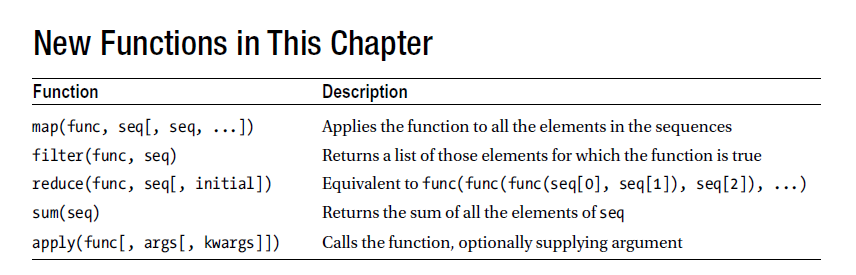

chapter 6: Trees
=================================
이장에서는 어떤것을 하는방법을 컴퓨터에게 말할 수 있는 그룹문을 함수로 표현하는 법을 배우도록 하겠다.
그것은 단 한번만 말한다.
계속해서 똑같은 상세 명령을 내릴 필요가 없다.
이장에서는 파라미터와 스코핑에 대한 내용으로 반복이 무엇이고 어떻게 실행되는지 배워보자.

6.1 Laziness is a Virtue
---------------------------
피노나치 숫자에 대한 예를 들어 보자
*피보나치 수(영어: Fibonacci numbers)는 첫째 및 둘째 항이 1이며 그 뒤의 모든 항은 바로 앞 두 항의 합인 수열이다. 처음 여섯 항은 각각 1, 1, 2, 3, 5, 8이

.. code-block:: python

    fibs = [0, 1]
    for i in range(8):
    fibs.append(fibs[-2] + fibs[-1])

    fibs = [0, 1]
    num = int(input('How many Fibonacci numbers do you want? '))
    for i in range(num-2):
    fibs.append(fibs[-2] + fibs[-1])
    print(fibs)

6.2 Abstraction and Struture
-------------------------------
축약은 단순 작업에 편리하다. 인간에게 컴퓨터 프로그램을 이해시킬 수 있는 중요 요소이다.
컴퓨터는 그 자체로 매우 간결하고 특별한 지시에 대해서 아주 좋아한다. 그러나 인간은 그렇지 않다.
만약 영화관을 가는길을 물어 보면, 앞으로 10걸음 가고 90도 돌아서 ....., 아마도 당신은 금방 잊어 버릴것이다.
길을 건너서 다리를 건너면 오른편으로 영화관이 보일것이다라고 얘기했다면 이해했을 것이다.
어떻게 겆고 다리를 어떻게 건너는지를 아는 조건에서는 당신은 상세한 설명이 필요없다.
컴퓨터 프로그램도 똑같은 구조로 되어 있다. 당신의 프로그램은 간결해야 한다. 페이지 다운,빈번도 계산,각 빈도수 프린트
이러한 것은 쉽게 이해할 수 있다.
다음 설명을 파이썬으로 변경해 보자.

.. code-block:: python

    page = download_page()
    freqs = compute_frequencies(page)
    for word, freq in freqs:
    print(word, freq)

6.3 Creating Your Own Functions
---------------------------------
함수라른 것은 파라미터를 매개체로 해서 호출할 수 있는 것을 의미한다.
함수를 실행하면 어떤 액션을 취하고 리턴값을 주게 되어 있다.
일반적으로 어떤것이 호출할 수 있는지 아니면 빌트인 함수 callable이 아닌지 말할 수 있다.

.. code-block:: python

    >>> import math
    >>> x = 1
    >>> y = math.sqrt
    >>> callable(x)
    False
    >>> callable(y)
    True

이전장에서 말했듯이 함수는 구조적 프로그래밍의 중심이다.

.. code-block:: python

    def hello(name):
        return 'Hello, ' + name + '!'

Documenting Functions
~~~~~~~~~~~~~~~~~~~~~~
코드에 코멘트를 처리하는것 이외에 함수 앞단에 string으로 넣는것을 docstring 이라고 한다.

.. code-block:: python

    def square(x):
        'Calculates the square of the number x.'
        return x * x

docstring은 다음처럼 접근할 수 있다.

.. code-block:: python

    >>> square.__doc__
    'Calculates the square of the number x.'

특별한 빌트인 함수로 help도 유용하다.

.. code-block:: python

    >>> help(square)
    Help on function square in module __main__:
    square(x)
    Calculates the square of the number x.

Functions That Aren’t Really Functions
~~~~~~~~~~~~~~~~~~~~~~~~~~~~~~~~~~~~~~~
함수는 수학적 의미에서 항상 파라미터들로부터 계산되어진 어떤 값을 리턴한다.
파이썬에서는 어떤 함수는 리턴을 하지 않는다.
파이썬에서 리턴하지 않는 함수는 리턴값을 가지지 않는다.리턴 문구를 쓴다면 리턴 이후는 값이 없다.

6.4 The Magic of Parameters
-----------------------------
함수를 사용하는것은 직관적이고 그것을 생성하는것은 복잡하지 않다.

Can I Change a Parameter?
~~~~~~~~~~~~~~~~~~~~~~~~~
함수가 파리미터를 통해 값을 얻는다. 그 값을 변경할 수 있는가?
파라미터는 변수값이다.
함수안에서 할당한 값은 밖에 있는 값을 변화 시키지 않는다.
함수 안에서의 strings(numbers,tuples)는 변경할 수 없다.따라서 그것은 변경할 수 없다.

.. code-block:: python

    >>> def try_to_change(n):
    ... n = 'Mr. Gumby'
    ...
    >>> name = 'Mrs. Entity'
    >>> try_to_change(name)
    >>> name
    'Mrs. Entity'

    >>> name = 'Mrs. Entity'
    >>> n = name # This is almost what happens when passing a parameter
    >>> n = 'Mr. Gumby' # This is done inside the function
    >>> name
    'Mrs. Entity'

.. code-block:: python

    >>> def change(n):
    ... n[0] = 'Mr. Gumby'
    ...
    >>> names = ['Mrs. Entity', 'Mrs. Thing']
    >>> change(names)
    >>> names
    ['Mr. Gumby', 'Mrs. Thing']

    >>> names = ['Mrs. Entity', 'Mrs. Thing']
    >>> n = names # Again pretending to pass names as a parameter
    >>> n[0] = 'Mr. Gumby' # Change the list
    >>> names
    ['Mr. Gumby', 'Mrs. Thing']
위에서 함수에서 변경 불가능한것과 같이 아래 처험 동일하게 처리할 수 있다.
이런 종류를 봐왔을 것이다.
이런것을 피하기 위해서 list를 복사해서 쓴다.

.. code-block:: python

    >>> names = ['Mrs. Entity', 'Mrs. Thing']
    >>> n = names[:]
    >>> n is names
    False
    >>> n == names
    True

여기서 n을 변경하더라도 names에는 영향을 미치지 않는다.

.. code-block:: python

    >>> n[0] = 'Mr. Gumby'
    >>> n
    ['Mr. Gumby', 'Mrs. Thing']
    >>> names
    ['Mrs. Entity', 'Mrs. Thing']

Why Would I Want to Modify My Parameters?
~~~~~~~~~~~~~~~~~~~~~~~~~~~~~~~~~~~~~~~~~~~~
데이터 구조를 변경하기 위하여 함수를 사용하는것은 프로그램에 축약을 소개하기에 좋은 방법이다.
이름을 저장하고 first name,middle name,last name을 검색하는 프로그램을 짜보자.
데이터 구조는 다음과 같다.

.. code-block:: python

    storage = {}
    storage['first'] = {}
    storage['middle'] = {}
    storage['last'] = {}

데이터 구조 저장소는 first,middle,last를 갖는 dictionary이다. 각 키 아래 각자 dictionary를 저장한다.
first,middle,last를 key로 하고 각각 값으로 사람의 리스트를 집어 넣는다.

.. code-block:: python

    >>> me = 'Magnus Lie Hetland'
    >>> storage['first']['Magnus'] = [me]
    >>> storage['middle']['Lie'] = [me]
    >>> storage['last']['Hetland'] = [me]

    >>> storage['middle']['Lie']
    ['Magnus Lie Hetland']

앞서 본것과 같이 이러한 구조에 사람을 집어 넣는것은 단순 작업이다.특히 fist,middle,last 이름을 가진 사람의 경우이다.
다음의 예를 보자.

.. code-block:: python

    >>> my_sister = 'Anne Lie Hetland'
    >>> storage['first'].setdefault('Anne', []).append(my_sister)
    >>> storage['middle'].setdefault('Lie', []).append(my_sister)
    >>> storage['last'].setdefault('Hetland', []).append(my_sister)
    >>> storage['first']['Anne']
    ['Anne Lie Hetland']
    >>> storage['middle']['Lie']
    ['Magnus Lie Hetland', 'Anne Lie Hetland']

큰 프로그램을 짤 경우 다음 예를 보자.

.. code-block:: python

    def init(data):
        data['first'] = {}
        data['middle'] = {}
        data['last'] = {}

    >>> storage = {}
    >>> init(storage)
    >>> storage
    {'middle': {}, 'last': {}, 'first': {}}

이름을 저장하기 전에 얻어오는 경우를 생각해 보자.

.. code-block:: python

    def lookup(data, label, name):
        return data[label].get(name)

    >>> lookup(storage, 'middle', 'Lie')
    ['Magnus Lie Hetland']

다음 예를 보자

.. code-block:: python

    def store(data, full_name):
        names = full_name.split()
        if len(names) == 2: names.insert(1, '')
        labels = 'first', 'middle', 'last'
        for label, name in zip(labels, names):
            people = lookup(data, label, name)
            if people:
                people.append(full_name)
            else:
            data[label][name] = [full_name]

    >>> MyNames = {}
    >>> init(MyNames)
    >>> store(MyNames, 'Magnus Lie Hetland')
    >>> lookup(MyNames, 'middle', 'Lie')
    ['Magnus Lie Hetland']

다음 또한 동작이 된다.

.. code-block:: python

    >>> store(MyNames, 'Robin Hood')
    >>> store(MyNames, 'Robin Locksley')
    >>> lookup(MyNames, 'first', 'Robin')
    ['Robin Hood', 'Robin Locksley']
    >>> store(MyNames, 'Mr. Gumby')
    >>> lookup(MyNames, 'middle', '')
    ['Robin Hood', 'Robin Locksley', 'Mr. Gumby']

6.4 What If My Parameter is Immutable?
-----------------------------------------
어떤 언어들(C++, Pascal,Ada) 파라미터를 엮고 함수밖에서 변경하는 것이 다반사이다.
파이썬은 이것이 직접적으로 가능하지 않다. 파라미터 오브젝트들만 단지 변경가능하다.
숫자같은 변경 불가능한 것은 어떻게 할까?
미안하지만 그것은 할 수 없다. 당신의 함수로 부터 필요로 하는 모든 값을 리턴해야하기때문이다.
다음 예를 보자.

.. code-block:: python

    >>> def inc(x): return x + 1
    ...
    >>> foo = 10
    >>> foo = inc(foo)
    >>> foo
    11
파라미터값을 변경하고자 하면 다음처럼 리스트에 랩핑해서 얻을 수 있다.

.. code-block:: python

    >>> def inc(x): x[0] = x[0] + 1
    ...
    >>> foo = [10]
    >>> inc(foo)
    >>> foo
    [11]

Keyword Parameters and Defaults
~~~~~~~~~~~~~~~~~~~~~~~~~~~~~~~~~
이제껏 사용했던 파라미터는 포지션 파라미터이고 이것은 파라미터 위치가 중요하기때문이다.

.. code-block:: python

    def hello_1(greeting, name):
        print('{}, {}!'.format(greeting, name))
    def hello_2(name, greeting):
        print('{}, {}!'.format(name, greeting))

    >>> hello_1('Hello', 'world')
    Hello, world!
    >>> hello_2('Hello', 'world')
    Hello, world!
두 결과값은 동일하다.

.. code-block:: python

    >>> hello_1(greeting='Hello', name='world')
    Hello, world!

    >>> hello_1(name='world', greeting='Hello')
    Hello, world!

이처럼 쓰이는 파라미터를 키워드 파라미터라고 한다. 키워드 파라미터의 힘은 각 파라미터글 구분할 수 있다는 것이다.
이상한 파라미터 호출을 하는것을 피하기 위한 것이다.

.. code-block:: python

    >>> store('Mr. Brainsample', 10, 20, 13, 5)

키워드 파라미터가 없다면 함수에서 디폴트 값으로 줄 수 있다.

.. code-block:: python

    def hello_3(greeting='Hello', name='world'):
        print('{}, {}!'.format(greeting, name))

    >>> hello_3()
    Hello, world!
    >>> hello_3('Greetings')
    Greetings, world!
    >>> hello_3('Greetings', 'universe')
    Greetings, universe!

    >>> hello_3(name='Gumby')
    Hello, Gumby!

다음 함수 예는 이름을 필요로 한다. 인사말과 기호 추가를 필요로 한다.

.. code-block:: python

    def hello_4(name, greeting='Hello', punctuation='!'):
        print('{}, {}{}'.format(greeting, name, punctuation))

    >>> hello_4('Mars')
    Hello, Mars!
    >>> hello_4('Mars', 'Howdy')
    Howdy, Mars!
    >>> hello_4('Mars', 'Howdy', '...')
    Howdy, Mars...
    >>> hello_4('Mars', punctuation='.')
    Hello, Mars.
    >>> hello_4('Mars', greeting='Top of the morning to ya')
    Top of the morning to ya, Mars!
    >>> hello_4()

Collecting Parameters
~~~~~~~~~~~~~~~~~~~~~~~
다음 예를 보자.

.. code-block:: python

    def print_params(*params):
        print(params)

    >>> print_params('Testing')
    ('Testing',)
프린트 되는것을 보면 tuple 타입임을 알 수 있다.

.. code-block:: python

    def print_params_2(title, *params):
        print(title)
        print(params)

    >>> print_params_2('Params:', 1, 2, 3)
    Params:
    (1, 2, 3)

파리미터가 없으면 빈 tuple로 리턴한다.

.. code-block:: python

    >>> print_params_2('Nothing:')
    Nothing:
    ()
다음 예처럼 중간에 와도 된다.그렇지만 마지막 파라미터에 대해서는 지정을 해줘야 한다.

.. code-block:: python

    >>> def in_the_middle(x, *y, z):
    ... print(x, y, z)
    ...
    >>> in_the_middle(1, 2, 3, 4, 5, z=7)
    1 (2, 3, 4, 5) 7
    >>> in_the_middle(1, 2, 3, 4, 5, 7)
    Traceback (most recent call last):
    File "<stdin>", line 1, in <module>
    TypeError: in_the_middle() missing 1 required keyword-only argument: 'z'

스타는 키워드 전달자를 모으지 않는다.

.. code-block:: python

    >>> print_params_2('Hmm...', something=42)
    Traceback (most recent call last):
    File "<stdin>", line 1, in <module>
    TypeError: print_params_2() got an unexpected keyword argument 'something'

별두개를 사용해서도 가능하다.

.. code-block:: python

    >>> def print_params_3(**params):
    ... print(params)
    ...
    >>> print_params_3(x=1, y=2, z=3)
    {'z': 3, 'x': 1, 'y': 2}

다음 예에서처럼 tuple 구조보다는 dictionary 구조임을 알 수 있다.

.. code-block:: python

    def print_params_4(x, y, z=3, *pospar, **keypar):
        print(x, y, z)
        print(pospar)
        print(keypar)

    >>> print_params_4(1, 2, 3, 5, 6, 7, foo=1, bar=2)
    1 2 3
    (5, 6, 7)
    {'foo': 1, 'bar': 2}
    >>> print_params_4(1, 2)
    1 2 3
    ()
    {}

 다음 예를 보자.

.. code-block:: python

    def store(data, *full_names):
        for full_name in full_names:
            names = full_name.split()
            if len(names) == 2: names.insert(1, '')
            labels = 'first', 'middle', 'last'
            for label, name in zip(labels, names):
                people = lookup(data, label, name)
                if people:
                    people.append(full_name)
                else:
                    data[label][name] = [full_name]

    def init(data):
        data['first'] = {}
        data['middle'] = {}
        data['last'] = {}

    def lookup(data, label, name):
        return data[label].get(name)

    d={}
    init(d)
    store(d,'Han solo')

 Reversing the Process
~~~~~~~~~~~~~~~~~~~~~~~~
tuples 와 dictionaries를 통해 파라미터값을 얻는것을 배웠다. 사실 반대로 가능하다.

.. code-block:: python

    def add(x, y):
        return x + y

다음처럼 두 수를 더하고자 tuple을 만들어 보자.
params = (1, 2)

이전에 했던것과 반대되는 개념이다.
파라미터를 얻는대신 그것들을 늘어 놓았다.

>>> add(*params)
3

dictionaries에도 마찬가지로 쓰일 수 있다

.. code-block:: python

    def hello_3(greeting='Hello', name='world'):
        print('{}, {}!'.format(greeting, name))

    >>> params = {'name': 'Sir Robin', 'greeting': 'Well met'}
    >>> hello_3(**params)
    Well met, Sir Robin!
*,** 둘다 사용을 해서 함수를 호출할때 tuple 또는 dictionary를 넘길 수 있다.

.. code-block:: python

    >>> def with_stars(**kwds):
    ... print(kwds['name'], 'is', kwds['age'], 'years old')
    ...
    >>> def without_stars(kwds):
    ... print(kwds['name'], 'is', kwds['age'], 'years old')
    ...
    >>> args = {'name': 'Mr. Gumby', 'age': 42}
    >>> with_stars(**args)
    Mr. Gumby is 42 years old
    >>> without_stars(args)
    Mr. Gumby is 42 years old

6.5 Parameter Practice
-----------------------------
많은 파라미터들이 전달되므로 혼란스러울 수 있다. 다음 예를 보자.

.. code-block:: python

    def story(**kwds):
        return 'Once upon a time, there was a ' \
            '{job} called {name}.'.format_map(kwds)
    def power(x, y, *others):
        if others:
            print('Received redundant parameters:', others)
        return pow(x, y)

    def interval(start, stop=None, step=1):
        'Imitates range() for step > 0'
        if stop is None: # If the stop is not supplied ...
            start, stop = 0, start # shuffle the parameters
        result = []
        i = start # We start counting at the start index
        while i < stop: # Until the index reaches the stop index ...
            result.append(i) # ... append the index to the result ...
            i += step # ... increment the index with the step (> 0)
        return result

    >>> print(story(job='king', name='Gumby'))
    Once upon a time, there was a king called Gumby.
    >>> print(story(name='Sir Robin', job='brave knight'))
    Once upon a time, there was a brave knight called Sir Robin.
    >>> params = {'job': 'language', 'name': 'Python'}
    >>> print(story(**params))
    Once upon a time, there was a language called Python.
    >>> del params['job']
    >>> print(story(job='stroke of genius', **params))
    Once upon a time, there was a stroke of genius called Python.
    >>> power(2, 3)
    8
    >>> power(3, 2)
    9
    >>> power(y=3, x=2)
    8
    >>> params = (5,) * 2
    >>> power(*params)
    3125
    >>> power(3, 3, 'Hello, world')
    Received redundant parameters: ('Hello, world',)

    >>> interval(10)
    [0, 1, 2, 3, 4, 5, 6, 7, 8, 9]
    >>> interval(1, 5)
    [1, 2, 3, 4]
    >>> interval(3, 12, 4)
    [3, 7, 11]
    >>> power(*interval(3, 7))
    Received redundant parameters: (5, 6)
    81

6.6 Scoping
-----------------------------
다음 예를 보자.

.. code-block:: python

    >>> x = 1
    >>> scope = vars()
    >>> scope['x']
    1
    >>> scope['x'] += 1
    >>> x
    2

보이지 않은 dictionary를 namespace,scope라고 한다.
글로벌 scope와 더블어 각 함수는 새로운 것을 생성한다.

.. code-block:: python

    >>> def foo(): x = 42
    ...
    >>> x = 1
    >>> foo()
    >>> x
    1

함수를 호출하면서 새로운 namespace를 생성하기때문에 foo안에 블락으로 사용되어진다.

6.7 Recursion
-----------------------------
함수를 만들고 호출하는것을 배웠다.
함수는 다른 함수를 호출한다. 놀라운것은 자기 자신을 호출하는 경우이다.
이러한 것들을 만나지 않았다면 recursion이 무엇인가 의아해 할것이다.
다음은 형식이다.

.. code-block:: python

    def recursion():
    return recursion()

Two Classics: Factorial and Power
~~~~~~~~~~~~~~~~~~~~~~~~~~~~~~~~~~~
다음 예를 보자.

.. code-block:: python

    def factorial(n):
        result = n
        for i in range(1, n):
            result *= i
        return result
이것을 다음처럼 바꿀수 있다.
n=1 인경우는 1값을 리턴하고
그렇지 않은 경우는 f(n)*factorial(n-1)이 된다.

.. code-block:: python

    def factorial(n):
        if n == 1:
            return 1
        else:
            return n * factorial(n - 1)
또 다른 예를 보자.
pow,**를 계산하는것처럼 파워를 계산한다고 하자.
몇가지 방법으로 파워를 정의할 수 있다. pow(x,n)은 x를 n-1만큼 곱한것이다. pow(2,3)은 2X2X2=8 이 된다.

.. code-block:: python

    def power(x, n):
        result = 1
        for i in range(n):
            result *= x
        return result
똑같이 다음처럼 변경이 가능하다.

.. code-block:: python

    def power(x, n):
        if n == 0:
            return 1
        else:
            return x * power(x, n - 1)

6.8 Another Classi:Binary Search
------------------------------------
스무고개에 대한 게임을 알것이다. 임의의 숫자를 맞추기 위해서 좁혀가야 한다.
반을 쪼개서 그 윗수인가 아닌가? 등등...
이런것들은 전통적으로 반복적 알고리즘에 속한다.
반복적인 경우에 중요한 것은 숫자가 저장이 된다는 것이다.
다음 예는 binary search의 예이다.

.. code-block:: python

    def search(sequence, number, lower, upper):
        if lower == upper:
            assert number == sequence[upper]
            return upper
        else:
            middle = (lower + upper) // 2
            if number > sequence[middle]:
                return search(sequence, number, middle + 1, upper)
            else:
                return search(sequence, number, lower, middle)

    >>> seq = [34, 67, 8, 123, 4, 100, 95]
    >>> seq.sort()
    >>> seq
    [4, 8, 34, 67, 95, 100, 123]
    >>> search(seq, 34)
    2
    >>> search(seq, 100)
    5

6.9 A Quick Summary
------------------------------------
Abstraction:
Function definition:
Parameters:
Scopes:
Recursion:
Functional programming:

6.10 New Functions in This Chapter
------------------------------------

6.11 What Now?
------------------------------------

