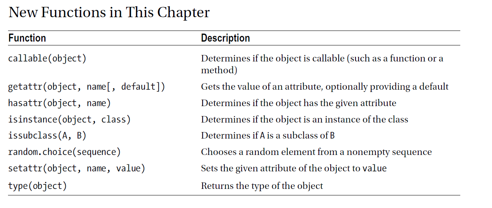

chapter 7: Graphs
==========================================
이 장에서는 당신이 원하는 어떤 오브젝트를 만드는 것이다.

7.1 The Magic of Objects
----------------------------
객체지향 프로그램에서 오브젝트란 데이터 모음이고 그 데이터를 접근하고 복사하는 함수들의 모음이다.
글로벌 변수와 함수들을 쓰는 대신 오브젝트들 쓰는 이유는 다음과 같다.

- Polymorphism
- Encapsulation
- Inheritance

객체지향 프로그래밍 관점에서 이러한 컨셉들의 순서는 다르다.

Polymorphism
~~~~~~~~~~~~~~~
Polymorphism은 "그리스의 말 다양한 형태를 가진다"라는 어원에서 유래된다.
그것은 기본적으로 어떤 종류의 오브젝트들을 변수가 참조하는지 알지 못하더라도,오브젝트의 타입에 따라 다르게 나오는 동작을 수행할 수도
있다.
예를 들면,식품을 사는 온라인 사이트에 지불을 하는 시스템을 가정해 보자.
모든 걱정해야할것은 합과 모든 카드를 취합하는 것이다.
일단 당신은 그 프로그램이 그것을 받을 수 있게 어떤 상품이 있는지 특별화 해야 한다.
다음처럼 tuple로 받을 것이다.

('SPAM', 2.50)
필요한 것은 설명태그와 가격표이다. 그런데 어떤 현명한 소비자가 웹사이트의 일부로 경매를 한다고 생각하자.

다음 예를 보자.

.. code-block:: python

    # Don't do it like this ...
    def get_price(object):
    if isinstance(object, tuple):
    return object[1]
    else:
    return magic_network_method(object)

    # Don't do it like this ...
    def get_price(object):
    if isinstance(object, tuple):
    return object[1]
    elif isinstance(object, dict):
    return int(object['price'])
    else:
    return magic_network_method(object)

Encapsulation
~~~~~~~~~~~~~~~

Inheritance
~~~~~~~~~~~~~

7.2 Classes
-------------------
클래스를 만들어 보자.

.. code-block:: python

    __metaclass__ = type # Include this if you’re using Python 2
    class Person:
        def set_name(self, name):
        self.name = name

        def get_name(self):
            return self.name
        def greet(self):
            print("Hello, world! I'm {}.".format(self.name))

    >>> foo = Person()
    >>> bar = Person()
    >>> foo.set_name('Luke Skywalker')
    >>> bar.set_name('Anakin Skywalker')
    >>> foo.greet()
    Hello, world! I'm Luke Skywalker.
    >>> bar.greet()
    Hello, world! I'm Anakin Skywalker.

다음처럼 class밖에서 access할 수 있다.

.. code-block:: python

    >>> foo.name
    'Luke Skywalker'
    >>> bar.name = 'Yoda'
    >>> bar.greet()
    Hello, world! I'm Yoda.

Attributes, Functions, and Methods
~~~~~~~~~~~~~~~~~~~~~~~~~~~~~~~~~~~
self는 메쏘드와 함수를 구분하는 것이다.
다음 예처럼 메쏘드는 self를 갖지만 함수는 갖지 않는다.

.. code-block:: python

    >>> class Class:
    ... def method(self):
    ... print('I have a self!')
    ...
    >>> def function():
    ... print("I don't...")
    ...
    >>> instance = Class()
    >>> instance.method() I have a self!
    >>> instance.method = function
    >>> instance.method() I don't...

다음 예를 보자.

.. code-block:: python

    >>> class Bird:
    ... song = 'Squaawk!'
    ... def sing(self):
    ... print(self.song)
    ...
    >>> bird = Bird()
    >>> bird.sing()
    Squaawk!
    >>> birdsong = bird.sing
    >>> birdsong()
    Squaawk!

 위의 예처럼 변수에 self 함수를 전달했는데 바로 변수를 self 함수처럼 쓰일 수 있다.

Privacy Revisited
~~~~~~~~~~~~~~~~~~~~
이전에 제시했던 예제를 다시 한번 보자.

.. code-block:: python

    >>> c.name
    'Sir Lancelot'
    >>> c.name = 'Sir Gumby'
    >>> c.get_name()
    'Sir Gumby'

파이썬은 프라이버시를 직접 지원하지 않는다. 그러나 프로그래머가 밖에서 attribute를 억세스할때 알려준다.
결국에는 object를 사용할때 object를 어떻게 사용할지 알아야 한다.
이것은 약간 트릭처럼 프라이빗 attribute처럼 쓸 수 있다.
메쏘드 또는 attribute를 private로 만들기 위해서 __ 를 사용한다.

.. code-block:: python

    class Secretive:
        def __inaccessible(self):
            print("Bet you can't see me ...")
        def accessible(self):
            print("The secret message is:")
            self.__inaccessible()

    >>> s = Secretive()
    >>> s.__inaccessible()

언더스코어는 이상할지 몰라도, 다른 언어처럼 표준 private 메쏘드이다.
클래스 정의안에 클래스 이름 앞에 하나의 언더스코어를 넣으므로 더블 언더 스코어를 넣은 이름은 모두 번역된다.

.. code-block:: python

    >>> Secretive._Secretive__inaccessible
    <unbound method Secretive.__inaccessible>

    >>> s._Secretive__inaccessible()
    Bet you can't see me ...

The Class Namespace
~~~~~~~~~~~~~~~~~~~~~~
다음 두 함수는 동일하다.

.. code-block:: python

    def foo(x): return x * x
    foo = lambda x: x * x
다음처럼 바로 class를 실행할 수 있다.

.. code-block:: python

    class C:
        print('Class C being defined...')

다음을 생각해 보자.

.. code-block:: python

    class MemberCounter:
        members = 0
        def init(self):
            MemberCounter.members += 1

    >>> m1 = MemberCounter()
    >>> m1.init()
    >>> MemberCounter.members
    1
    >>> m2 = MemberCounter()
    >>> m2.init()
    >>> MemberCounter.members

    >>> m1.members
    2
    >>> m2.members
    2

    >>> m1.members = 'Two'
    >>> m1.members
    'Two'
    >>> m2.members
    2

Specifying a Superclass
~~~~~~~~~~~~~~~~~~~~~~~~~
이장 앞에서 얘기했듯이 subclass는 superclass로 정의해서 확장할 수 있다.

.. code-block:: python

    class Filter:
        def init(self):
            self.blocked = []
        def filter(self, sequence):
            return [x for x in sequence if x not in self.blocked]
    class SPAMFilter(Filter): # SPAMFilter is a subclass of Filter
        def init(self): # Overrides init method from Filter superclass
        self.blocked = ['SPAM']

    >>> f = Filter()
    >>> f.init()
    >>> f.filter([1, 2, 3])
    [1, 2, 3]

    >>> s = SPAMFilter()
    >>> s.init()
    >>> s.filter(['SPAM', 'SPAM', 'SPAM', 'SPAM', 'eggs', 'bacon', 'SPAM'])
    ['eggs', 'bacon']

Investigating Inheritance
~~~~~~~~~~~~~~~~~~~~~~~~~~

7.3 Some Thoughts on Object-Oriented Design
---------------------------------------------

7.4 A Quick Summary
----------------------

Objects:
~~~~~~~~~~~~
 An object consists of attributes and methods. An attribute is merely a
variable that is part of an object, and a method is more or less a function that
is stored in an attribute. One difference between (bound) methods and other
functions is that methods always receive the object they are part of as their first
argument, usually called self.

Classes:
~~~~~~~~~~~~~
A class represents a set (or kind) of objects, and every object (instance)
has a class. The class’s main task is to define the methods its instances will have.
Polymorphism: Polymorphism is the characteristic of being able to treat objects
of different types and classes alike—you don’t need to know which class an
object belongs to in order to call one of its methods.

Encapsulation:
~~~~~~~~~~~~~~~~~
Objects may hide (or encapsulate) their internal state. In some
languages, this means that their state (their attributes) is available only through
their methods. In Python, all attributes are publicly available, but programmers
should still be careful about accessing an object’s state directly, since they might
unwittingly make the state inconsistent in some way.

Inheritance:
~~~~~~~~~~~~~~~~~~
One class may be the subclass of one or more other classes. The
subclass then inherits all the methods of the superclasses. You can use more
than one superclass, and this feature can be used to compose orthogonal
(independent and unrelated) pieces of functionality. A common way of
implementing this is using a core superclass along with one or more mix-in
superclasses.

Interfaces and introspection:
~~~~~~~~~~~~~~~~~~~~~~~~~~~~~~
In general, you don’t want to prod an object too
deeply. You rely on polymorphism and call the methods you need. However,
if you want to find out what methods or attributes an object has, there are
functions that will do the job for you.

Abstract base classes:
~~~~~~~~~~~~~~~~~~~~~~~~~
Using the abc module, you can create so-called abstract
base classes, which serve to identify the kind of functionality a class should
provide, without actually implementing it.

Object-oriented design:
~~~~~~~~~~~~~~~~~~~~~~~~~~~
There are many opinions about how (or whether!) to do
object-oriented design. No matter where you stand on the issue, it’s important
to understand your problem thoroughly and to create a design that is easy to
understand.

New Functions
~~~~~~~~~~~~~~~~~~

