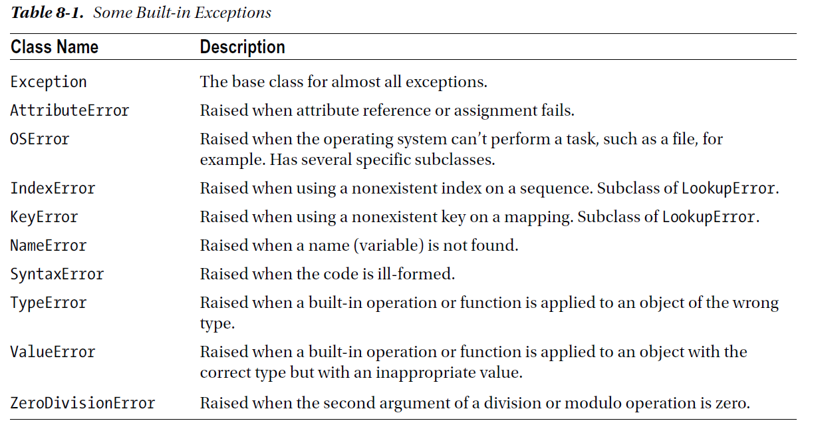

chapter 8: Membership Structures
=========================================
컴퓨터 프로그램을 하다보면 정상적인 경우와 예외적인 경우를 만나게 될것이다. 그러한 예외적인 경우 또는 자주 발생되지 않는 어떤것을
오류라고 한다.그러한 오류를 다루기 위해서 이벤트가 발생하는 조건을 만들 수 있다.어찌됐건 이런것은 비효율적이고 고정적이지 않을 뿐 아니라
프로그램을 비합리적으로 만든다.
당신은 이러한 이벤트를 무시할 수도 있다.그러나 파이썬은 exception-handling-mechanism을 제공한다.
이장에서는 excetion을 만들고 관리하는 방법과 다양한 방법으로 처리하는 법을 배우도록 하겠다.

8.1 What is Exception?
-------------------------
exception 환경을 표현하기 위하여 파이썬은 exception objects를 사용한다. 에러를 발생했을 경우, exception을 발생한다.
그러한 오류를 다루지 못한다면, 그러한 프로그램은 trace-back으로 종료한다.

.. code-block:: python

    >>> 1 / 0
    Traceback (most recent call last):
    File "<stdin>", line 1, in ?
    ZeroDivisionError: integer division or modulo by zero

그러한 에러 메세지들이 exception을 위해서 할수 있는것이 전부라면, 재미가 없을 것이다.
사실은 각각의 exception은 어떤 클래스( ZeroDivisionError)의 인스턴스라는 것이다. 이러한 인스턴스를은 생성되고 다양하게 표현된다.

8.2 Making Things Go Wrong....Your Way
-------------------------------------------
본것처럼,어떤것이 잘못되었을때 exception이 자동으로 표현되어진다. 이러한것들을 어떻게 처리할지를 보기전에 어떻게 하면 exception이
나오는지 한번 보자.

The raise Statement
~~~~~~~~~~~~~~~~~~~~
Exception을 만들기 위해서 raise 문을 쓰면 된다.

.. code-block:: python

    >>> raise Exception
    Traceback (most recent call last):
    File "<stdin>", line 1, in ?
    Exception
    >>> raise Exception('hyperdrive overload')
    Traceback (most recent call last):
    File "<stdin>", line 1, in ?
    Exception: hyperdrive overload

많은 build-in class들이 가능하다.

.. code-block:: python

    >>> raise ArithmeticError
    Traceback (most recent call last):
    File "<stdin>", line 1, in ?
    ArithmeticError

Custom Exception Classes
~~~~~~~~~~~~~~~~~~~~~~~~~~~
build-in exception이 많은 범위에서 그리고 많은 목적으로 지원할지라도,당신만의 exception을 만들 필요가 있다.
다음처험 exception 클래스의 하위 클래스로 추가해서 쓰면 된다.

.. code-block:: python

    class SomeCustomException(Exception): pass

8.3 Catching Exceptions
-------------------
이전에 얘기했듯이, exception에 관한 재미있는 것은 그것을 다룬다는 것이다.
다음 예를 보자 두 숫자를 입력해서 처리하는 것을 보자.

.. code-block:: python

    x = int(input('Enter the first number: '))
    y = int(input('Enter the second number: '))
    print(x / y)

    Enter the first number: 10
    Enter the second number: 0
    Traceback (most recent call last):
    File "exceptions.py", line 3, in ?
    print(x / y)
    ZeroDivisionError: integer division or modulo by zero

상기 프로그램을 Exception을 넣어 처리하면 다음과 같다.

.. code-block:: python

    try:
        x = int(input('Enter the first number: '))
        y = int(input('Enter the second number: '))
        print(x / y)
    except ZeroDivisionError:
        print("The second number can't be zero!")

Look, Ma, No Arguments!
~~~~~~~~~~~~~~~~~~~~~~~
다음 예를 보자.

.. code-block:: python

    class MuffledCalculator:
        muffled = False
        def calc(self, expr):
            try:
                return eval(expr)
            except ZeroDivisionError:
                if self.muffled:
                    print('Division by zero is illegal')
                else:
                    raise

    ma=MuffledCalculator()
    print(ma.calc('10/2'))

More Than One except Clause
~~~~~~~~~~~~~~~~~~~~~~~~~~~~

.. code-block:: python

    Enter the first number: 10
    Enter the second number: "Hello, world!"
    Traceback (most recent call last):
    File "exceptions.py", line 4, in ?
    print(x / y)
    TypeError: unsupported operand type(s) for /: 'int' and 'str'

위 예에서처럼 숫자가 아닌 string을 넣었을 경우 에러 처리를 해야 한다.
다음처럼 오류처리를 추가하면 된다.

.. code-block:: python

    try:
        x=int(input('input your first number:'))
        y=int(input('input your second number:'))
        print(x/y)

    except ZeroDivisionError:
        print('The Second number cannot be zero')
    except TypeError:
        print('That was not number,was it?')

Catching Two Exceptions with One Block
~~~~~~~~~~~~~~~~~~~~~~~~~~~~~~~~~~~~~~~
다음처럼 한 블럭안에 한개 이상의 exception을 처리하고 싶으면 다음처럼 tuple로 처리 가능하다.

.. code-block:: python

    try:
        x = int(input('Enter the first number: '))
        y = int(input('Enter the second number: '))
        print(x / y)
    except (ZeroDivisionError, TypeError, NameError):
        print('Your numbers were bogus ...')

Catching the Object
~~~~~~~~~~~~~~~~~~~~~~
각각의 에러 메세지를 처리하는것을 보고 싶으면 다음처럼 하면 된다.
에러 메세지를 e로 받아서 처리하는 것이다.

.. code-block:: python

    try:
        x = int(input('Enter the first number: '))
        y = int(input('Enter the second number: '))
        print(x / y)
    except (ZeroDivisionError, TypeError, NameError) as e:
        print(e)

A Real Catchall
~~~~~~~~~~~~~~~~~
다음처럼 실제 메세지를 보고 싶을때 처리하면 좋다.

.. code-block:: python

    try:
        x = int(input('Enter the first number: '))
        y = int(input('Enter the second number: '))
        print(x / y)
    except Except as e:
        print(e)

When All Is Well
~~~~~~~~~~~~~~~~~~~
다음처럼 오류처리를 하고 다음에 else 처리로 가능하다.

.. code-block:: python

    try:
        print('A simple task')
    except:
        print('What? Something went wrong?')
    else:
        print('Ah ... It went as planned.')

이렇게 되면 이전에 배웠던 중복 exception을 다음처럼 처리할 수 있다.

.. code-block:: python

    while True:
        try:
            x = int(input('Enter the first number: '))
            y = int(input('Enter the second number: '))
            value = x / y
            print('x / y is', value)
        except:
            print('Invalid input. Please try again.')
        else:
            break

And Finally
~~~~~~~~~~~~~~
마지막으로 finally 구문을 소개하도록 하겠다.
try 구문과 같이 어떤 에러가 나는지 상관없이 처리를 종료할때 쓰인다.

.. code-block:: python

    x = None
    try:
        x = 1 / 0
    finally:
        print('Cleaning up ...')
        del x

다음 구문처럼 여러개를 혼용해서 써도 유용할때가 있다.

.. code-block:: python

    try:
        1 / 0
    except NameError:
        print("Unknown variable")
    else:
        print("That went well!")
    finally:
        print("Cleaning up.")

8.4 Exceptions and Functions
--------------------------------
exception 과 function은 함께 잘 쓰인다. exception이 function안에서 발생되면 그곳에서 다루어 지지 않는다.
그 function을 호출한데까지 거슬러 올라간다.
그곳에서 다루어지지 않는다면 메인프로그램까지 계속 거슬러 올라간다.만약 그곳에 exception hanlder가 없다면
그 프로그램은 그곳에서 stack trace로 멈춘다.
예를 보자.

.. code-block:: python

    >>> def faulty():
    ... raise Exception('Something is wrong')
    ...
    >>> def ignore_exception():
    ... faulty()
    ...
    >>> def handle_exception():
    ... try:
    ... faulty()
    ... except:
    ... print('Exception handled')
    ...
    >>> ignore_exception()
    Traceback (most recent call last):
    File '<stdin>', line 1, in ?
    File '<stdin>', line 2, in ignore_exception
    File '<stdin>', line 2, in faulty
    Exception: Something is wrong
    >>> handle_exception()
    Exception handled

8.5 The Zen of Exceptions
--------------------------------
Exception Handling은 매우 복잡하지 않다.만약 어떤 코드가 어떤 종류의 exception을 일으키고 stack trace로 종료하고 싶으면
try/except, try/finally 구문을 필요로 할것이다.
때때로 exception handling으로 처리할 수 있는것처럼 조건 구문을 가지고 동일하게 처리할 수 있다.
다른관점이라면, try/except 보다도 if/else 구문이 일반 프로그램에서 더 자주 구현된다.
dictionary가 있고 특별한 key에 대한 값을 얻는다고 하자. 그 값이 있건 있다면, 만약 그 값이 없다면 아무것도 할 수 없다.
다음 예처럼 처리 가능하다.

.. code-block:: python

    def describe_person(person):
        print('Description of', person['name'])
        print('Age:', person['age'])
        if 'occupation' in person:
            print('Occupation:', person['occupation'])

    def describe_person(person):
        print('Description of', person['name'])
        print('Age:', person['age'])
        try:
            print('Occupation:', person['occupation'])
        except KeyError: pass

다음 예를 보자.

.. code-block:: python

    try:
        obj.write
    except AttributeError:
        print('The object is not writeable')
    else:
        print('The object is writeable')

8.6 Not All That Exceptional
--------------------------------
그 값이 정확하지 않은 경우 warning을 사용한다.
이럴때는 wornings 모듈에 warn 함수를 사용한다.

.. code-block:: python

    >>> from warnings import warn
    >>> warn("I've got a bad feeling about this.")
    __main__:1: UserWarning: I've got a bad feeling about this.
    >>>

warning 함수는 한번만 표시된다.마지막 라인을 다시 실행해도 아무일이 발생되지 않는다.
filterwarnings를 사용하여 warning을 구분지을 수 있다.

.. code-block:: python

    >>> from warnings import filterwarnings
    >>> filterwarnings("ignore")
    >>> warn("Anyone out there?")
    >>> filterwarnings("error")
    >>> warn("Something is very wrong!")
    Traceback (most recent call last):
    File "<stdin>", line 1, in <module>
    UserWarning: Something is very wrong!

상기에서 warn은 UserWarning으로 발생되었다.
다음처럼 특정지어서 warning을 표기할 수 있다.

.. code-block:: python

    >>> filterwarnings("error")
    >>> warn("This function is really old...", DeprecationWarning)
    Traceback (most recent call last):
    File "<stdin>", line 1, in <module>
    DeprecationWarning: This function is really old...
    >>> filterwarnings("ignore", category=DeprecationWarning)
    >>> warn("Another deprecation warning.", DeprecationWarning)

8.7 A Quick Summary
--------------------------------

Exception objects:
~~~~~~~~~~~~~~~~~~
Exceptional situations (such as when an error has occurred)
are represented by exception objects. These can be manipulated in several ways,
but if ignored, they terminate your program.
Raising exceptions:
~~~~~~~~~~~~~~~~~~~
You can raise exceptions with the raise statement. It
accepts either an exception class or an exception instance as its argument. You
can also supply two arguments (an exception and an error message). If you call
raise with no arguments in an except clause, it “reraises” the exception caught
by that clause.
Custom exception classes: You can create your own kinds of exceptions by
subclassing Exception.
Catching exceptions:
~~~~~~~~~~~~~~~~~~~~~~
You catch exceptions with the except clause of a try
statement. If you don’t specify a class in the except clause, all exceptions are
caught. You can specify more than one class by putting them in a tuple. If you
give two arguments to except, the second is bound to the exception object. You
can have several except clauses in the same try/except statement, to react
differently to different exceptions.
else clauses:
~~~~~~~~~~~~~~
You can use an else clause in addition to except. The else clause
is executed if no exceptions are raised in the main try block.
finally:
~~~~~~~~~~~~
You can use try/finally if you need to make sure that some code (for
example, cleanup code) is executed, regardless of whether or not an exception is
raised. This code is then put in the finally clause.
Exceptions and functions: When you raise an exception inside a function,
it propagates to the place where the function was called. (The same goes for
methods.)
Warnings:
~~~~~~~~~~
Warnings are similar to exceptions but will (in general) just print
out an error message. You can specify a warning category, which is a subclass of
Warning.

New Functions
~~~~~~~~~~~~~~~~~~~~~

.. image:: ./img/chapter8-2.png
