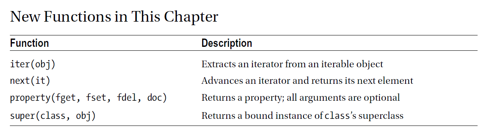

chapter 9: Heaps
====================================================
파이썬에서는 앞뒤로 2개의 언더 스코어를 붙이는 독특한 이름을 가진것이 있다.
예를 들면 (__future__) 어리한 spelling은 중요한 의미를 가진다는 것이다.
그런 이름을 생성하지 말아야 한다. 언어에 있어서 그런 유명한 것들은 매직으로 구성되어 있다.
만약 당신의 object가 그런 method중에 하나를 구현한다고 하면 이러한 method는 특별한 환경하에서 호출될 것이다.
이것은 드물게 직접 호출될 필요가 있다.
이 장에서는 이러한 magic method를 다룰것이다.

9.1 If You're Not Using Python 3
------------------------------------

9.2 Constructors
-------------------
첫번째 magic method는 constructor이다.이전에 이런 어구를 들어보지 못했다면, 이미 이전 예제에서 사용되어 왔던
초기화 method이다.

.. code-block:: python

    >>> f = FooBar()
    >>> f.init()
constructor는 다음처럼 만들 수 있다.

.. code-block:: python

    >>> f = FooBar()

파이썬에서 constructor는 매우 쉽다.
단지 init 함수를 변경하면 __init__ 으로 바꿔주면 된다.

.. code-block:: python

    class FooBar:
        def __init__(self):
        self.somevar = 42
    >>> f = FooBar()
    >>> f.somevar
    42

어떤 파라미터와 어떻게 constructor가 동작되는지 궁금할지도 모르겠다.

.. code-block:: python

    class FooBar:
        def __init__(self, value=42):
        self.somevar = value

    >>> f = FooBar('This is a constructor argument')
    >>> f.somevar
    'This is a constructor argument'

Overriding Methods in General, and the Constructor in Particular
~~~~~~~~~~~~~~~~~~~~~~~~~~~~~~~~~~~~~~~~~~~~~~~~~~~~~~~~~~~~~~~~~~~~~
7장에서 inheritance를 봤다. 각 클래스는 한개 이상의 superclass를 가지고 있다.
class B 인스턴스에서 이러한 함수가 호출되고 이것이 발견되지 않으면 superclass A를 찾게 될것이다.

.. code-block:: python

    class A:
        def hello(self):
            print("Hello, I'm A.")
    class B(A):
        pass

    a = A()
    b = B()
    a.hello()
    #Hello, I'm A.
    b.hello()
    #Hello, I'm A

    class B(A):
        def hello(self):
            print("Hello, I'm B.")

    b = B()
    b.hello()

아래처험 상속받아 method를 다시 정의 하면 결과가 달라진다.
overriding은 일반적으로 상속 메카니즘에서 중요한 요소이다.특히나 constructor에 있어서는 중요하다.
constructor는 새로운 constructor ojbect를 초기화 한다.
모든 하위 클래스들은 상위 클래스 뿐 아니라 그 자신의 초기화 코드가 필요할 것이다.
overriding 메카니즘이 모든 method들에 똑같을지라도,보통의 method를 만났을때보다 constructor를 만났을때 종종 특별한 문제를 만나게
될것이다.
클래스의 constructor를 override하게 되면 상위 클래스의 constructor를 호출할 필요가 있다.
그리고 초기화 되지 않은 object를 가지게 될것이다.

.. code-block:: python

    class Bird:
        def __init__(self):
            self.hungry = True
        def eat(self):
            if self.hungry:
                print('Aaaah ...')
                self.hungry = False
            else:
                print('No, thanks!')

    b = Bird()
    b.eat()
    b.eat()

    class SongBird(Bird):
        def __init__(self):
            self.sound = 'Squawk!'
        def sing(self):
            print(self.sound)

    sb = SongBird()
    sb.sing()
    sb.eat()

    Traceback (most recent call last):
    File "<stdin>", line 1, in ?
    File "birds.py", line 6, in eat
    if self.hungry:
    AttributeError: SongBird instance has no attribute 'hungry'

SongBrid는 Bird의 하위 클래스이다.그래서 eat method를 상속받는다.만약 그것을 호출한다면 오류가 날것이다.
constructor가 override 되면 hungry atrribute를 초기화 하는 코드가 포함되지 않는다.

Calling the Unbound Superclass Constructor
~~~~~~~~~~~~~~~~~~~~~~~~~~~~~~~~~~~~~~~~~~~~
이 장에서 얘기하는것은 이야기기 이어질 것이다.
현재 버젼에서 super 함수를 사용한다는 것은 명확히 길이 있다.
이전 내용에서 super class의 constructor를 호출하는 것은 매우 쉽다. 앞에서 언급했던 초기화 문제에 대해서 답을 주고자 한다.

.. code-block:: python

    class Bird():
        def __init__(self):
            self.Hungry=True
        def eat(self):
            if self.Hungry==True:
                print('Aahh.....')
                self.Hungry=False
            else:
                print('No Thanks')

    class SongBird(Bird):
        def __init__(self):
            super().__init__()   ## super init add
            self.sound='Squawk'
        def sing(self):
            print(self.sound)

    b=Bird()
    b.eat()

    b.eat()

    sb=SongBird()
    sb.sing()
    sb.eat()

9.3 Item Access
-------------------
__init__ method는 당신이 만나게 될 가장 중요한 것이다.다른것들은 다양한 많은 것들을 당신이 할 수 있도록 도와준다.

The Basic Sequence and Mapping Protocol
~~~~~~~~~~~~~~~~~~~~~~~~~~~~~~~~~~~~~~~~~
sequences 나 mappings는 기본적으로 items들에 대한 조합이다. 기본적으로 기본동작(프로토콜)을 구현하기 위하여
immutalbe  오브젝트는 두가지, mutalbe 오브젝트라고 하면 4가지의 중요한 method를 배우게 될것이다.

__len__(self):
~~~~~~~~~~~~~~~~~
이 method는 collection에 들어있는 item 갯수를 리턴한다.

__getitem__(self, key):
~~~~~~~~~~~~~~~~~~~~~~~~~
이 method는 주어진 key값에 대해 값을 리턴한다.

__setitem__(self, key, value)
~~~~~~~~~~~~~~~~~~~~~~~~~~~~~~
이 method는 주어진 key,value값을 저장한다.

__delitem__(self, key):
~~~~~~~~~~~~~~~~~~~~~~~~~~
이 method는 key에 해당하는 item을 지우기 위해 사용된다.

몇가지 추가적인 내용이 있다.
- sequence의 -값은 뒤쪽부터 셀때 사용되어 진다.
- key가 부정확한 type이라면  TypeError 가 뜨게된다.
- sequence가 올바른 타입이고 허락된 범위밖에 있다면 IndexError가 뜨게 된다.

다음 예를 보자.

.. code-block:: python

    def check_index(key):
        """
        Is the given key an acceptable index?
        To be acceptable, the key should be a non-negative integer. If it
        is not an integer, a TypeError is raised; if it is negative, an
        IndexError is raised (since the sequence is of infinite length).
        """
        if not isinstance(key, int): raise TypeError
        if key < 0: raise IndexError

    class ArithmeticSequence:
        def __init__(self, start=0, step=1):
            """
            Initialize the arithmetic sequence.
            start - the first value in the sequence
            step - the difference between two adjacent values
            changed - a dictionary of values that have been modified by
            the user
            """
            self.start = start # Store the start value
            self.step = step # Store the step value
            self.changed = {} # No items have been modified
        def __getitem__(self, key):
            """
            Get an item from the arithmetic sequence.
            """
            check_index(key)
            try: return self.changed[key] # Modified?
            except KeyError: # otherwise ...
                return self.start + key * self.step # ... calculate the value

        def __setitem__(self, key, value):
            """
            Change an item in the arithmetic sequence.
            """
            check_index(key)
            self.changed[key] = value # Store the changed value

    s=ArithmeticSequence(1,2)
    print(s[4])
    s[4] = 2
    print(s[4])

    print(s[5])

다음처럼 하면 잘못된 표현이다.

.. code-block:: python

    >>> del s[4]
    Traceback (most recent call last):
    File "<stdin>", line 1, in ?
    AttributeError: ArithmeticSequence instance has no attribute '__delitem__'

그리고 무한대의 sequence값을 가지기때문에 __len__ method가 없다.
다음처럼 하면 TypeError 또는 IndexError 가 나온다.

.. code-block:: python

    >>> s["four"]
    Traceback (most recent call last):
    File "<stdin>", line 1, in ?
    File "arithseq.py", line 31, in __getitem__
    check_index(key)
    File "arithseq.py", line 10, in checkIndex
    if not isinstance(key, int): raise TypeError
    TypeError
    >>> s[-42]
    Traceback (most recent call last):
    File "<stdin>", line 1, in ?
    File "arithseq.py", line 31, in __getitem__
    check_index(key)
    File "arithseq.py", line 11, in checkIndex
    if key < 0: raise IndexError
    IndexError

Subclassing list, dict, and str
~~~~~~~~~~~~~~~~~~~~~~~~~~~~~~~~~
sequence에는 위에서 언급한 method외에 여러가지가 있다. __iter__ method가 대표적이다.
또다른 키워드는 inheritance이다.

.. code-block:: python

    class CounterList(list):
        def __init__(self, *args):
            super().__init__(*args)
            self.counter = 0
        def __getitem__(self, index):
            self.counter += 1
            return super(CounterList, self).__getitem__(index)

    cl = CounterList(range(10))
    print(cl)
    print(cl.reverse())
    del cl[3:6]
    print(cl)
    print(cl.counter)
    print(cl[4] + cl[2])
    print(cl.counter)

9.4 More Magic
-------------------
특별한 이름이 많은 목적을 위해 존재한다.

9.5 Properties
-------------------
7장에서 accessor method를 배웠다. Accessors들은 getHeight,setHeight등을 말하며 그 특성값들을 알아내기 위해서 사용된다.
이것과 같은 캡슐화된 값은 어떤 행동들이 취해질때 중요하다.
다음 예제를 보자.

.. code-block:: python

    class Rectangle:
        def __init__(self):
            self.width = 0
            self.height = 0
        def set_size(self, size):
            self.width, self.height = size
        def get_size(self):
            return self.width, self.height

    r = Rectangle()
    r.width = 10
    r.height = 5
    print(r.get_size())

    r.set_size((150, 100))
    print(r.width)
    print(r.height)
    print(r.get_size())

The property Function
~~~~~~~~~~~~~~~~~~~~~~
상기에서 추가 1라인만 해보자.

.. code-block:: python

    class Rectangle:
        def __init__(self):
            self.width = 0
            self.height = 0
        def set_size(self, size):
            self.width, self.height = size
        def get_size(self):
            return self.width, self.height
        size=property(get_size,set_size)

    r = Rectangle()
    r.width = 10
    r.height = 5
    print(r.size)
    r.size = 150, 100
    print(r.width)

Static Methods and Class Methods
~~~~~~~~~~~~~~~~~~~~~~~~~~~~~~~~~~~~
잠깐 새로운 classmethod staticmethod 를 사용하여 class method와 static method를 wrapping 하는 방법을 알아보자.
static method는 self 전달자 없이 사용된다.class 자체를 호출하도록 사용한다.
class method는 cls라는 seif 형태의 파라미터로 정의되어진다.
class object에서 바로 class method를 호출할 수 있다. cls 파라미터는 자동으로 class에 묶인다.
예를 보자.

.. code-block:: python

    class MyClass:
        def smeth():
            print('This is a static method')
        smeth = staticmethod(smeth)
        def cmeth(cls):
            print('This is a class method of', cls)
        cmeth = classmethod(cmeth)

    mc=MyClass()
    mc.cmeth()
    mc.smeth()

    ## python 2.7
    class MyClass2:
        @staticmethod
        def smeth():
            print('This is a static method')
        @classmethod
        def cmeth(cls):
            print('This is a class method of', cls)

    MyClass2.smeth()
    MyClass2.cmeth()

__getattr__, __setattr__, and Friends
~~~~~~~~~~~~~~~~~~~~~~~~~~~~~~~~~~~~~~~
object을 억세스하여 모든 attribute를 가로채는것이 가능하다.
이전 스타일로 properties를 구현하기 위하여 이것을 사용할 수 있다.
attribute를 접근할때 코드가 실행되도록 하기 위하여,두개의 매직 method를 사용해야 한다.

__getattribute__(self, name):
~~~~~~~~~~~~~~~~~~~~~~~~~~~~~~~
Automatically called when the attribute name is
accessed. (This works correctly on new-style classes only.)

__getattr__(self, name):
~~~~~~~~~~~~~~~~~~~~~~~~~
Automatically called when the attribute name is
accessed and the object has no such attribute.

__setattr__(self, name, value):
~~~~~~~~~~~~~~~~~~~~~~~~~~~~~~~~~
Automatically called when an attempt is
made to bind the attribute name to value.

__delattr__(self, name):
~~~~~~~~~~~~~~~~~~~~~~~~~
 Automatically called when an attempt is made to
delete the attribute name.

property를 사용하는것보다 좀 더 장난스럽지만 이러한 methods들은 강력하다. 왜냐하면 몇가지 property를 다루는 method들중에 하나로
코딩되어 있기때문이다.

.. code-block:: python

    class Rectangle:
        def __init__ (self):
            self.width = 0
            self.height = 0
        def __setattr__(self, name, value):
            if name == 'size':
                self.width, self.height = value
            else:
                self. __dict__[name] = value
        def __getattr__(self, name):
            if name == 'size':
                return self.width, self.height
            else:
                raise AttributeError()

    rt=Rectangle()
    rt.__setattr__('size', (2,3))
    print(rt.__getattr__('size'))

9.6 Iterators
-------------------
__iter__에 대해서 좀 더 자세히 알아보자.
어떤 것을 여러번 반복하는 것을 의미한다.루프로 했던 것들이다. 지금까지 for loops로 sequences,dictionaries에 대해서만
반복했다.
그러나 다른 object에 대해서도 또한 __iter__를 이용하여 가능하다.
__iter__ method는 iterator를 반환한다.어떤 전달자 없이도 가능한  __next__라고 불리우는 method들이다.
__next__ method를 호출했을때 iterator 는 다음값을 리턴해야 한다.
method가 호출되고 더이상 return할 iterator가 없으면 StopIteration exception을 띄워야 한다.
build-in 함수인 next(it) 는 __next__() 와 동일하다.
여기서 잠깐 우리는 왜 list를 사용할까? 만약 순서대로 어떤 함수를 계산하는 함수가 있다면 당신은 순서대로 그것들을 필요로 할것이다.
만약 값이 크다면 그 리스트는 많은 메모리를 점유하게 될것이다.
다음 피보나치 수열에 대한 예제을 보자.

.. code-block:: python

    class Fibs:
        def __init__(self):
            self.a = 0
            self.b = 1
        def __next__(self):
            self.a, self.b = self.b, self.a + self.b
            return self.a
        def __iter__(self):
            return self

    fibs = Fibs()

    for f in fibs:
        if f > 1000:
            print(f)
            break

    # build-in next
    it = iter([1, 2, 3])
    print(next(it))
    print(next(it))

iterator,iterables에 대한 iterating에 추가적으로 그것들을 sequence로 변환할 수 있다.
sequence를 사용하는 모든 context에서 iterator를 대신 사용할 수 있다.
다음 예제는 list contructor를 사용해서 iterator를 list로 만들었다.

.. code-block:: python

    class TestIterator:
        value = 0
        def __next__(self):
            self.value += 1
            if self.value > 10: raise StopIteration
            return self.value
        def __iter__(self):
            return self

    ti = TestIterator()
    print(list(ti))

9.7 Generators
-------------------
역사적 이력이 있어서 simple generator라고 불리우는 Generators는 상대적으로 파이썬에서 새로운 것이다.
수년동안 가장 강력한 특징중에 하나이다.
오히려 generator라는 컨셉은 진보된것이다.
generator는 일반 함수에서 정의되어진 iterator 종류의 하나이다.
예제를 통해 자세히 알아보자.

Making a Generator
~~~~~~~~~~~~~~~~~~~
generator를 만드는 것은 간단하다. 함수를 만드는것과 같다.
예를 보자.

.. code-block:: python

    nested = [[1, 2], [3, 4], [5]]

    def flatten(nested):
        for sublist in nested:
            for element in sublist:
                yield element

    for num in flatten(nested):
        print(num)

    print(list(flatten(nested)))

A Recursive Generator
~~~~~~~~~~~~~~~~~~~~~~
이전에 nested loop로 2 level을 다루었다.더 심도있는 레벨을 다루기 위해서는 tree구조를 다루어야 할것이다.
다음처럼 level이 있는 경우 처리하고 없는경우 오류 처리를 하는 방법도 있다.

.. code-block:: python

    def flatten(nested):
        try:
            for sublist in nested:
                for element in flatten(sublist):
                    yield element
        except TypeError:
            yield nested

    print(list(flatten([[[1], 2], 3, 4, [5, [6, 7]], 8])))

이것을 다루기 위해서 generator 앞쪽에 test를 추가해야 한다.
다음 예를 보자.

.. code-block:: python

    def flatten(nested):
        try:
    # Don't iterate over string-like objects:
            try: nested + ''
            except TypeError: pass
            else: raise TypeError
            for sublist in nested:
                for element in flatten(sublist):
                    yield element
        except TypeError:
            yield nested

    print(list(flatten(['foo', ['bar', ['baz']]])))

Generators in General
~~~~~~~~~~~~~~~~~~~~~~~
예제를 통해 generator 사용법을 배웠다. generator는 yield라는 키워드를 포함한  함수라른 것을 봤다.
이것이 호출되면 함수 바디안에 있는 코드는 실행되지 않는다. 대신 iterator가 리턴된다.
매번 value값이 요구되면 generator안에 있는 코드는 yield 또는 return을 만날때까지 실행되어 진다.
yield라는 것은 value값이 나와야 한다는 것을 의미한다.
return은 generator가 실행을 멈추어야 한다는 것을 의미한다.
다른말로 한다면,generator는 2가지 generator-function 과 generator-iterator 로 구성되어진다.
generator function은 yield를 포함한 def 구문에 의해서 정의되어지는 것이다.
generator iterator는 함수가 리턴되는 것이다.

.. code-block:: python

    >>> def simple_generator():
    yield 1
    ...
    >>> simple_generator
    <function simple_generator at 153b44>
    >>> simple_generator()
    <generator object at 1510b0>

Generator Methods
~~~~~~~~~~~~~~~~~~
generator 와 다른것이랑 사이의 커뮤니케이션 채널을 사용함으로써 시작한 후에 generator 제공할 지도 모르겠다.

-send
-yield

다음 예를 보자.

.. code-block:: python

    def repeater(value):
        while True:
            new = (yield value)
            if new is not None: value = new

    >>> r = repeater(42)
    >>> next(r)
    42
    >>> r.send("Hello, world!")
    "Hello, world!"

generator는 또한 다음 두가지 method를 제공한다.

-throw : generator안에 exception을 처리할 때 쓰임
-close : generator를 그만두고자 할때 쓰임

Simulating Generators
~~~~~~~~~~~~~~~~~~~~~~~~~~
다음 예를 보자.

.. code-block:: python

    def flatten(nested):
        result = []
        try:
            # Don't iterate over string-like objects:
            try: nested + ''
            except TypeError: pass
            else: raise TypeError
            for sublist in nested:
                for element in flatten(sublist):
                    result.append(element)
        except TypeError:
            result.append(nested)
        return result

9.8 The Eight Queens
----------------------
여기서는 보통의 프로그램 문제를 해결하기 위하여 generator를 사용하는것을 알아보도록 하겠다.

Generators and Backtracking
~~~~~~~~~~~~~~~~~~~~~~~~~~~~~
generator는 점진적 결과물을 만드는 복잡한 반복적인 알고리즘에 이상적이다.
generator가 없다면 이러한 알고리즘은 반복적 호출을 할 수 있도록 추가적 파라미터로서 솔루션일 필요할 것이다.

The Problem
~~~~~~~~~~~~~~
skip

State Representation
~~~~~~~~~~~~~~~~~~~~~
skip

Finding Conflicts
~~~~~~~~~~~~~~~~~~
skip

The Base Case
~~~~~~~~~~~~~~~
skip

The Recursive Case
~~~~~~~~~~~~~~~~~~~~
skip

Wrapping It Up
~~~~~~~~~~~~~~~~
skip

9.9 A Quick Summary
-------------------

New-style versus old-style classes:

Magic methods:

Constructors:

Overriding:

Sequences and mappings:

Iterators:

Generators:

Eight Queens:

New Functions
~~~~~~~~~~~~~~~

