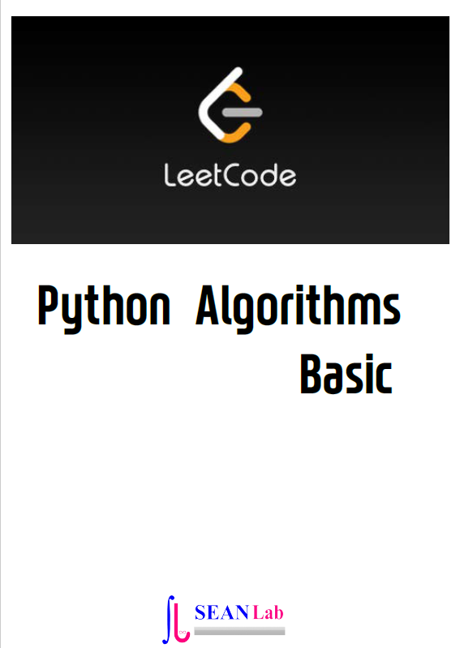

Python Algorithms
====================

    Problem solving with algorithms and Data structures using Python

      written by sean base on following books

.. image:: ./img/chapter0_4.png

`Github <https://github.com/newsteinking/High_pythonalgorithms>`_ | https://github.com/newsteinking/High_pythonalgorithms

.. toctree::
   :maxdepth: 4

   Introduction/toctree.rst
   AlgorithmAnalysis/toctree.rst
   BasicDS/toctree.rst
   Recursion/toctree.rst
   SortSearch/toctree.rst
   Trees/toctree.rst
   Graphs/toctree.rst

